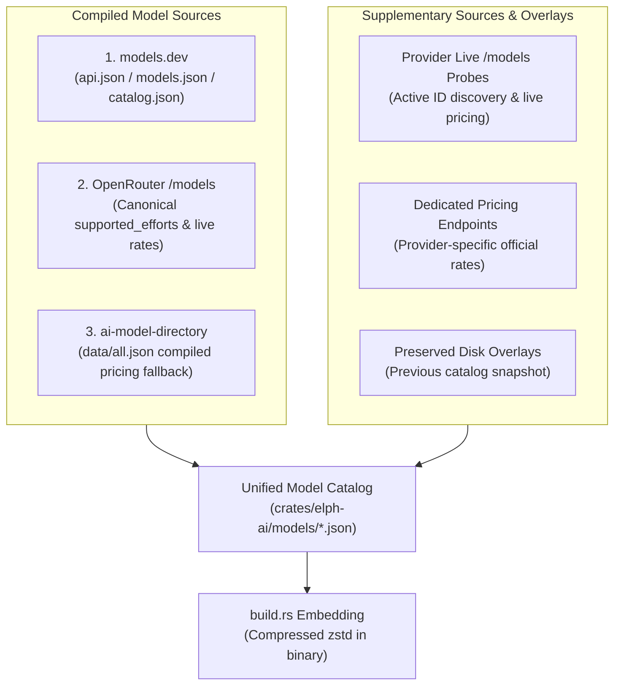

# Update Models (Multi-Source Catalog Compilation)

## Language & Conventions

- In-chat reports follow the user's language.
- Persisted docs, skill text, and generated comments stay English.

## Overview & Architecture

Model catalogs reside as JSON definitions in `crates/elph-ai/models/*.json` (and `models/index.json`). At compile time, `crates/elph-ai/build.rs` compresses them into zstd frames embedded directly in the binary. There is no generated Rust catalog source code to maintain manually.

Catalogs are produced by **compiling three primary compiled sources** alongside supplementary live discovery probes and dedicated endpoints:



---

## Compiled Model Sources

The catalog compiler relies on **three primary compiled sources**:

1. **models.dev** (`api.json`, `models.json`, `catalog.json`)
    - `api.json`: Nested `provider → {models}` index. Primary source for baseline costs, `reasoning_options`, modalities, and token limits.
    - `models.json` / `catalog.json`: Flat catalog index. Authoritative for `description`, `knowledge` (cutoff), `benchmarks`, `release_date`, and `weights`.
    - Cached locally under `models/.cache/models.dev/` with a 24h freshness check.

2. **OpenRouter** (`/api/v1/models`)
    - Authoritative and canonical source for `reasoning.supported_efforts` (thinking level mapping) and live per-token pricing (converted to per-million USD).
    - Requires `OPENROUTER_API_KEY` for authenticated live queries.

3. **ai-model-directory** (`The-Best-Codes/ai-model-directory`, `data/all.json`)
    - Compiled community catalog used as a pricing fallback when neither live API nor models.dev provides costs.
    - Fills the `reasoning` boolean flag only when models.dev has no opinion on that model.
    - Public, no key required (cached raw GitHub snapshot).

---

## Supplementary Sources & Provider Notes

Additional data sources and provider-specific configurations:

- **Provider Live `/models` Probes**:
    - Queried for active model discovery and live pricing.
    - _Public endpoints_: e.g. OpenCode (`/zen/v1/models`), OpenCode Go (`/zen/go/v1/models`), Hetzner, etc. (probed anonymously).
    - _Authwalled endpoints_: e.g. OpenAI, xAI, Mistral, Hyper, Infron, Kilo, etc. (probed with provider env keys when present).
- **Dedicated Pricing Endpoints**:
    - e.g. Nara Router (`https://router.bynara.id/api/pricing`) provides official USD per million rates (`official_in_usd_m` / `official_out_usd_m`) since Nara's `/v1/models` endpoint exposes no pricing. Credit fields are ignored.
- **Cline Model Directory** (`cline.rs`):
    - Cline (usage-billing) and ClinePass catalogs are built from Cline's **public** model directory (no API key required), not models.dev:
        - `https://api.cline.bot/api/v1/ai/cline/recommended-models` — curated id groups (`recommended` + `free` for `cline`, `clinePass` for `cline-pass`).
        - `https://api.cline.bot/api/v1/ai/cline/models` — full detail (per-token pricing, context length, input modalities) keyed by OpenRouter-style id.
    - Detail entries are paired to catalog ids by tail segment (`kimi-k3` → `moonshotai/kimi-k3`). ClinePass ids keep the `cline-pass/` prefix.
    - `CLINE_API_KEY` is **not** required for catalog generation (the `/v1/models` endpoint is authwalled, but the model directory is public).
- **Preserved Overlays & Previous Catalog Snapshot**:
    - Existing `models/*.json` entries are preserved for non-gateway manual overrides and fallback non-zero pricing when fresh sources are unpriced.

---

## Step-by-Step Execution Flow

When updating model catalogs, follow this systematic procedure:

### Step 1: Live Model Discovery & Auth Handling

- Query each provider's configured `/models` endpoint to discover the actual active model list.
- **Public Endpoints**: Query directly (e.g., OpenCode, OpenCode Go, Hetzner, etc.).
- **Authwalled Endpoints**: Check the environment for the required API key (`OPENROUTER_API_KEY`, `OPENAI_API_KEY`, `HYPER_API_KEY`, `INFRON_API_KEY`, `KILO_API_KEY`, `XAI_API_KEY`, etc.).
- **Graceful Fallback**: If the required API key is absent or the endpoint is unreachable, fall back gracefully to the compiled models.dev catalog or previous disk snapshot.

### Step 2: Handle Incomplete Endpoint Metadata

- Recognize that raw `/models` responses typically return only model IDs or sparse metadata. They often omit complete pricing tiers, supported effort levels, context limits, or cutoffs.
- Do not assume missing data implies a model is free or non-reasoning. All missing attributes must pass through the multi-source enrichment pipeline.

### Step 3: Run the Catalog Generator

Execute the generator CLI with workspace formatting:

```sh
cargo run -p elph-ai --features generate-models --bin generate-models -- chat && make fmt
```

_Alternative via Makefile:_

```sh
make generate-models ARGS="chat" && make fmt
```

**Helpful Generator Flags:**

| Flag                | Description                                                                |
| :------------------ | :------------------------------------------------------------------------- |
| `--force`           | Bypass the 24h freshness check and force re-fetching models.dev snapshots. |
| `--no-live-pricing` | Skip outbound `/models` live pricing/capability probes.                    |
| `--offline`         | Use only locally cached data under `models/.cache/`.                       |

### Step 4: Full Image Fixture Pass (Optional)

If updating image generation models alongside chat models:

```sh
cargo run -p elph-ai --features generate-models --bin generate-models -- all --no-live-pricing
```

### Step 5: Verify Quality Gates

Run verification tests and workspace checks:

```sh
# 1. Run provider and catalog unit tests
cargo test -p elph-ai --test providers --lib models

# 2. Verify workspace compilation and clippy lints
make check && make lint
```

**Quality Gate Checklist:**

1. `thinkingLevelMap: complete=N incomplete=0` — Every model must have all 7 keys populated.
2. `thinkingLevelMap source`: Unresolved count must be 0 for all `reasoning=true` models.
3. `cost source`: `none` must be 0 (no model left unpriced unless genuinely free).
4. `Verified N catalog providers are registered in builtin_providers()` — Every generated provider file must have a registered factory in `src/providers/builtin.rs`.

### Step 6: Rebuild the Binary

`build.rs` embeds `models/*.json` at compilation time. The binary must be rebuilt to ship the new definitions:

```sh
cargo build --release -p elph
```

### Step 7: Summarize Results for User

Report in the user's language:

- Total provider count and model count.
- Cost sourcing breakdown (`live-api`, `models.dev`, `ai-model-directory`, `previous`).
- Any unconfirmed thinking levels or skipped providers.
- Status of verification tests and quality gates.

---

## Field Resolution & Precedence Rules

### 1. Thinking Level Map (`thinkingLevelMap`)

Every model entry must define all 7 schema keys: `off`, `minimal`, `low`, `medium`, `high`, `xhigh`, `max` (`null` if unsupported).

Resolution precedence:

1. **Live Provider API (Canonical)**: If the `/models` response provides `reasoning.supported_efforts` (e.g. OpenRouter), map the native efforts onto the 7 keys (`"none"` → `"off"`, `"min"` → `"minimal"`, `"default"` → `"medium"`).
2. **models.dev `reasoning_options`**: Map effort levels from models.dev metadata.
3. **Provider-Family Overrides**:
    - **xAI Grok**: `low` / `high` / `max`
    - **Anthropic Opus/Sonnet 5/Fable**: `xhigh` / `max` (adaptive thinking)
    - **Anthropic Sonnet 4.5 / Opus 4.5 / Haiku 4.5 / 4.x**: `low` / `medium` / `high` / `max`
    - **OpenAI GPT-5.x reasoning**: `off` / `low` / `medium` / `high` / `xhigh`
    - **OpenAI O-series**: `low` / `medium` / `high`
4. **Preserved Overlays**: Keep valid previous hand-authored overrides.
5. **Explicit Unresolved**: Never guess from sibling models or silently fill `off`. Unconfirmed reasoning models must be flagged.

### 2. Cost / Pricing Resolution

Pricing precedence:

1. **Live API**: Exact model pricing from live `/models` response when available.
2. **Dedicated Pricing Endpoints**: Official dedicated endpoints (e.g. Nara Router `/api/pricing`).
3. **models.dev**: `api.json` pricing metadata.
4. **ai-model-directory**: `data/all.json` compiled fallback.
5. **Previous Non-Zero**: Retain previous disk values if unpriced in current sources.

### 3. Metadata Enrichment

- `description`, `knowledgeCutoff`, and `releaseDate` are populated from the merged models.dev `models.json` + `catalog.json` rich index.

---

## Code Map

| Path                                                     | Purpose                                                                                        |
| :------------------------------------------------------- | :--------------------------------------------------------------------------------------------- |
| `crates/elph-ai/bin/generate_models/main.rs`             | CLI entry point and argument parsing.                                                          |
| `crates/elph-ai/bin/generate_models/models_dev.rs`       | Fetches, caches, and merges models.dev `api`, `models`, and `catalog` datasets.                |
| `crates/elph-ai/bin/generate_models/provider_sources.rs` | Maps Elph providers to models.dev keys, base URLs, and live probe endpoints.                   |
| `crates/elph-ai/bin/generate_models/pricing.rs`          | Live `/models` probes, Nara `/api/pricing` sync, and ai-model-directory fallback.              |
| `crates/elph-ai/bin/generate_models/thinking_map.rs`     | Strict multi-source resolution of the 7-key `thinkingLevelMap`.                                |
| `crates/elph-ai/bin/generate_models/chat.rs`             | Catalog generation pipeline, index creation, and provider registration verification.           |
| `crates/elph-ai/bin/generate_models/cline.rs`            | Cline (usage-billing) + ClinePass live catalog builder (recommended-models + ai/cline/models). |
| `crates/elph-ai/models/*.json`                           | JSON catalog outputs (embedded into binary via `build.rs`).                                    |
| `crates/elph-ai/src/providers/builtin.rs`                | Built-in provider registrations and factory functions.                                         |

---

## Strict Invariants & Prohibitions

- **Never seed chat catalogs from pi**: Only models.dev, live provider APIs, Nara pricing, and ai-model-directory are valid sources.
- **Never guess thinking levels**: Every thinking level must be backed by live API metadata, models.dev, or an explicit provider override.
- **Never hand-edit generated JSON catalogs**: Use generator overlays or update provider sources in code, then regenerate.
- **Preserve fresh source precedence**: Fresh live API / models.dev data always takes precedence over stale catalog entries.
- **Do not commit without user confirmation**.
