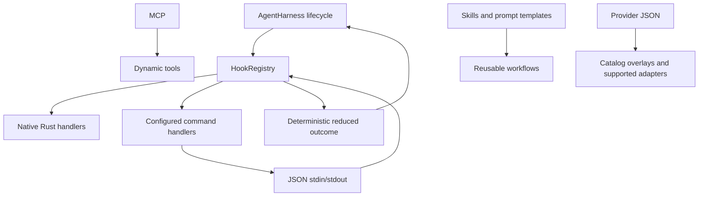
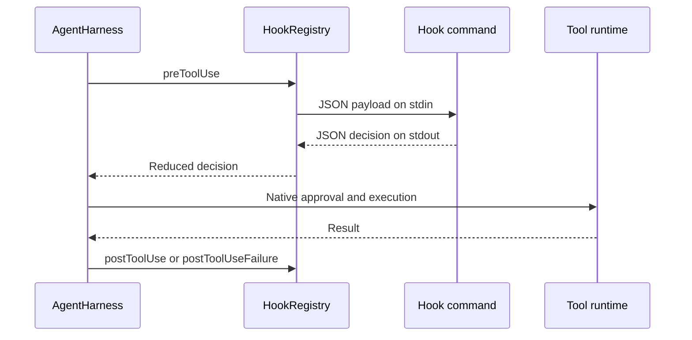

# Lifecycle hooks

Elph lifecycle hooks are native commands configured with JSON. They are an
automation and policy-observation mechanism around the agent loop; they are not
plugins and cannot add tools, providers, UI, or slash commands.

## Configuration

Elph reads these files in order:

1. `CONFIG_DIR/hooks.json`
2. `<project>/.elph/hooks.json`, only for a trusted project

The two `hooks` arrays are concatenated. Hook `id` values must be unique in the
combined configuration. A malformed file is skipped as a unit. The canonical
schema is [`schemas/hooks-schema.json`](../schemas/hooks-schema.json).
A minimal project configuration is available in [`.elph/hooks.json`](../.elph/hooks.json).

```json
{
    "$schema": "https://elph.space/hooks-schema.json",
    "hooks": [
        {
            "id": "audit-tool-calls",
            "event": "sessionStart",
            "command": "hooks/audit-tool-calls.sh",
            "args": [],
            "timeoutMs": 5000,
            "enabled": true
        }
    ]
}
```

`command` is executed directly; Elph does not implicitly invoke a shell.
Relative executable paths are resolved against the directory containing the
defining configuration file. The process working directory is the active
project directory. Use an explicit shell executable in `command` and `args`
when shell syntax is required.

The project configuration may reference an executable inside
`PROJECT_DIR/.elph/hooks/`, as the sample above does. Elph does not scan or
auto-load every file in that directory: each hook must be declared in
`hooks.json`. The sample script records the `sessionStart` JSON payload in
`.elph/hook-audit.log` and intentionally writes no stdout.

### Tool names for matchers

Matchers use the names registered in Elph's tool catalog. Availability depends
on compiled features, agent mode, and MCP activation. Common current names are:

| Group | Tool names |
| --- | --- |
| Read/search | `read_file`, `grep`, `find_path`, `list_dir` |
| File mutation | `edit_file`, `write_file`, `create_dir`, `copy_path`, `delete_path`, `move_path` |
| Shell | `shell_exec`, `shell_use` |
| Web | `web_search`, `web_fetch`, `web_extract` |
| Discovery | `list_available_tools`, `list_skills` |
| Agent | `ask_user_question`, `request_mode_change` |
| Goals/todos | `create_goal`, `get_goal`, `update_goal`, `set_goal_budget`, `todo_write`, `todo_read` |
| Memory | `memory_start_task`, `memory_end_task`, `memory_report`, `memory_contradict`, `memory_status`, `memory_search`, `memory_recent` |
| Session/collaboration | `get_session_summary`, `spawn_agent`, `send_message`, `followup_task`, `wait_agent`, `list_agents` |
| MCP | `mcp_{server}__{tool}` when registered and activated |

`apply_patch` is not an Elph model tool; use `edit_file` in a matcher for
regular file edits.

## Lifecycle



The currently supported command events are:

- `sessionStart`: after a new or resumed session is ready.
- `userPromptSubmit`: before an agent turn begins; this event is
  observation-only.
- `beforeAgent`: before a provider request; may return `systemPrompt`.
- `preToolUse`: before approval and execution; may return `decision`,
  `block`, and `reason`.
- `postToolUse`: after a successful tool call; may return `isError` or
  `details`.
- `postToolUseFailure`: after a failed tool call; may return `isError` or
  `details`.
- `preCompact`: before compaction; may return `cancel` or
  `customInstructions`.
- `postCompact`: after compaction; observation-only.
- `stop`: when a turn settles; observation-only.

`sessionEnd` is reserved in the schema for the orderly shutdown lifecycle but
is not emitted by the current session owners.

The event payload is a small JSON object on standard input. It contains no
credentials, provider headers, complete transcript, or arbitrary process
environment. For example, a `preToolUse` payload contains `toolName`,
`toolCallId`, and `toolInput`.



Handlers run serially in configuration order. A hook cannot loosen a native
approval decision. A `deny`/`block` result prevents the current tool call.
Invalid replacement data is rejected before it can enter the model context.

## Command protocol and limits

- Exit code `0` with empty stdout means no change.
- Non-empty stdout must be one JSON outcome for the event.
- Stderr is diagnostic text and is never parsed.
- Spawn errors, non-zero exits, timeouts, invalid JSON, and oversized output are
  logged and fail open for the current operation.
- Input is limited to 128 KiB; stdout and stderr are limited to 64 KiB.
- Returned context is limited to 32 KiB.
- The default timeout is 10 seconds and the maximum is 60 seconds.
- A hook process is terminated when its timeout expires; hook failures do not
  abort the surrounding agent operation.

Hooks are not a security boundary. Native tool approval, sandbox, agent mode,
MCP policy, authentication, and schema validation remain authoritative.
Commands run with the user's operating-system permissions. Do not use a hook
as the only control protecting sensitive files.

## Trust and reload

Home hooks are user-owned configuration. Project hooks are ignored until the
project passes Elph's executable-resource trust gate. On interactive TUI startup,
an untrusted project with `defaultProjectTrust: ask` displays a trust prompt
before the datastore or TUI opens. Choosing No, declining the prompt, or
starting without a terminal exits without launching the project. The doctor
output reports skipped or malformed project hooks.

Use `/trust` to mark the current project trusted. Use `/untrust` to write an
explicit `false` decision, but only when the project is currently trusted.
An explicit project decision overrides inherited trust from a parent directory.
The command palette shows exactly one of these commands based on the current
trust state, and refreshes that choice after either command succeeds.

`/reload` re-reads hook configuration and replaces the active command handlers
only after the new configuration has been parsed. It also reloads provider
catalogs, MCP resources, skills, and prompt templates through their existing
resource paths.

## Extensibility boundaries

- **MCP** adds dynamic tools and remote tool servers.
- **Skills and prompt templates** add reusable instructions and user-invoked
  workflows.
- **Provider JSON** in `CONFIG_DIR/providers/*.json` adds catalog overlays and
  disk-only providers when their API matches an existing Elph adapter.
- **Hooks** observe or influence lifecycle operations only.
- Built-in tools, UI, and slash commands are native Elph code. Hooks cannot
  register any of them.
