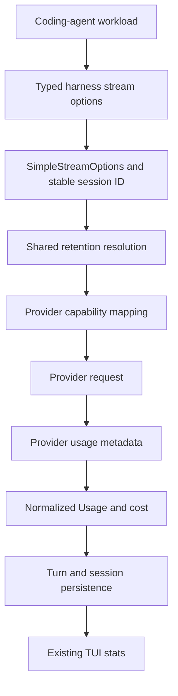

# PRD: Provider-managed context caching

**Status:** Implemented
**Research date:** 2026-08-28  
**Target crates:** `elph-ai`, `elph-agent`, `coding-agent`  
**Implementation owner:** Elph maintainers

The v1 implementation described below is shipped in the current branch. The
provider live probes remain release/manual checks because cache routing and TTL
behavior are nondeterministic; deterministic payload and usage tests are the CI
gate.

For the operational implementation guide, including configuration examples and
troubleshooting, see [`docs/context-caching.md`](../context-caching.md).

## Executive decision

Elph should implement **provider-managed prompt-prefix caching with a workload-aware
policy**.

- Normal agent turns and bounded tool loops use short-lived caching by default.
- A stable, opaque session ID provides cache-routing affinity where the provider
  supports it.
- Standalone calls that are unlikely to reuse their prefix disable cache writes.
- Provider adapters translate the same `CacheRetention` intent into their native
  request shape.
- Elph normalizes cache read/write usage and cost, but does not store model KV
  state or prompt bodies locally.

Do **not** build a local response cache, a cross-provider cache service, or explicit
Gemini `CachedContent` lifecycle management in v1. Those designs add invalidation,
privacy, persistence, and correctness problems without improving the dominant Elph
workload: a growing, multi-turn agent transcript.

This is not a greenfield feature. Elph already has most provider primitives. The
work is to make the policy coherent, close correctness gaps, and prevent cache
writes for requests with no realistic reuse.

## Terminology

- **Context caching / prompt caching:** provider-side reuse of precomputed KV state
  for an identical prompt prefix.
- **Prefix:** the stable beginning of the rendered request, including instructions,
  tools, messages, and provider-added content as applicable.
- **Cache breakpoint:** the end of a prefix that a provider may write and later
  reuse.
- **Cache affinity key:** an opaque routing hint such as `prompt_cache_key` or
  `session_id`. A matching key improves routing but never replaces prefix equality.
- **Short retention:** the provider's normal in-memory or ephemeral lifetime.
- **Long retention:** the longest supported non-durable provider lifetime exposed
  by the current API. It is a preference, not a cross-provider TTL guarantee.
- **Cache read/write usage:** provider-reported tokens read from or written to a
  prompt cache. These are distinct from uncached input tokens.

The existing `coding-agent` `system_prompt_cache` is unrelated. It avoids rebuilding
the system-prompt string locally; it does not avoid provider prefill computation.

## Problem statement

Agent requests repeatedly send a large stable prefix:

1. system instructions and project rules;
2. tool names, descriptions, and schemas;
3. prior conversation and tool results;
4. a small changing suffix for the next action.

Recomputing that prefix increases input cost and time to first token. Elph already
emits cache controls for several providers, but the behavior is inconsistent across
the stack:

- the harness exposes `cache_retention` as an untyped string but does not forward it
  into `SimpleStreamOptions`;
- standalone summarization/title/aside calls inherit the default cache-write policy;
- Anthropic message marking misses a trailing `tool_result`, which is the common
  suffix during an agent tool loop;
- Anthropic 1-hour cache-write usage is not populated even though cost accounting
  has a dedicated `cache_write_1h` field;
- OpenAI Responses cache-write tokens are not parsed;
- `supportsExplicitPromptCacheMode` exists in the provider schema and GPT-5.6
  catalog entries but is dropped by the Rust compatibility type;
- the legacy OpenAI `24h` field is not valid as the universal meaning of `long` for
  GPT-5.6 and newer;
- cache-retention resolution is duplicated in provider modules;
- provider/model-name heuristics can send unsupported cache fields to proxies.

The result can be a missed cache hit, incorrect cost, or a paid cache write that no
later request can reuse.

## Research

### Provider behavior

#### Anthropic Messages

Anthropic supports automatic top-level caching and explicit content-block
breakpoints. The default ephemeral lifetime is 5 minutes; `ttl: "1h"` is available
at a higher write price on supported models. A breakpoint covers the complete
prefix in wire order: tools, system, then messages.

For Elph, explicit breakpoints remain preferable to one automatic breakpoint:

- a system breakpoint preserves the most stable prefix;
- a tool breakpoint preserves stable schemas separately from the transcript;
- a message breakpoint advances with the conversation.

This gives the provider multiple fallback prefixes when the newest suffix changes.
The final message breakpoint must support `text`, `image`, and `tool_result`
content blocks.

Source: [Anthropic prompt caching](https://platform.claude.com/docs/en/build-with-claude/prompt-caching).

#### OpenAI Responses and Chat Completions

Prompt caching is automatic on supported models. `prompt_cache_key` improves
routing for requests with a shared prefix.

There are two materially different generations:

- GPT-5.6 and newer support implicit and explicit breakpoints. Their minimum
  cacheable prefix is 1,024 tokens. Cache writes cost more than normal input,
  cache reads are discounted, and the current configurable TTL is `30m` through
  `prompt_cache_options`.
- Earlier supported models use implicit breakpoints, generally require at least
  2,048 tokens, and may accept legacy `prompt_cache_retention: "24h"`.

For GPT-5.6+, explicit mode with no breakpoints is also the available way to
prevent implicit cache writes for a standalone request. Elph should use that
capability for `CacheRetention::None`, but continue to use implicit mode for normal
agent turns in v1. Designing and validating optimal explicit OpenAI breakpoints is
a separate optimization.

Source: [OpenAI prompt caching](https://developers.openai.com/api/docs/guides/prompt-caching).

#### OpenRouter and OpenAI-compatible gateways

OpenRouter combines provider-native caching with sticky routing. Most providers
cache implicitly. Anthropic and some other model families require explicit
`cache_control` blocks. A top-level or header `session_id` gives explicit
conversation affinity; otherwise OpenRouter derives affinity from opening
messages. Sticky sessions expire after inactivity and can fall back to another
provider.

The important design lesson is to select cache wire behavior from catalog
capability data, not from a model-name substring. Cline and OpenCode have both had
bugs from incomplete model lists or overly broad `claude`/`anthropic` heuristics.

Sources:

- [OpenRouter prompt caching](https://openrouter.ai/docs/guides/best-practices/prompt-caching)
- [Cline OpenRouter cache-control implementation](https://github.com/cline/cline/blob/8a6441fd/src/core/api/transform/openrouter-stream.ts)
- [OpenCode provider transform](https://github.com/anomalyco/opencode/blob/dev/packages/opencode/src/provider/transform.ts)

#### Amazon Bedrock Converse

Bedrock uses explicit `cachePoint` blocks. Supported locations, minimum token
counts, maximum checkpoints, and TTLs vary by model. Many models use a 5-minute
default, while supported models accept a one-hour TTL. A request below a model's
minimum still succeeds but does not create a cache entry.

Elph's existing system and final-user-message cache points match the provider
model. The implementation must keep model support detection and `none` handling
authoritative and preserve cache usage from Bedrock stream metadata.

Source: [Amazon Bedrock prompt caching](https://docs.aws.amazon.com/bedrock/latest/userguide/prompt-caching.html).

#### Google Gemini

Gemini 2.5 and newer models provide implicit caching with no request changes.
Responses report `cachedContentTokenCount`. Explicit caching creates an immutable
`CachedContent` resource with a TTL and storage cost.

Gemini CLI relies on implicit caching and reports cached-token metrics. Its normal
chat path does not create and persist explicit cache resources. This is the right
v1 precedent for Elph: a growing agent transcript is not a good fit for an
immutable explicit resource that must be recreated, persisted, expired, and
deleted.

Explicit Gemini caching may be reconsidered for a different product:
repeated questions over one large static document or media object.

Sources:

- [Gemini context caching](https://ai.google.dev/gemini-api/docs/generate-content/caching)
- [Gemini caching API](https://ai.google.dev/api/caching)
- [Gemini CLI](https://github.com/google-gemini/gemini-cli)

#### Mistral Conversations

Mistral uses a stable `prompt_cache_key` for multi-turn conversations and repeated
prefixes. Cache reads are discounted, but the key does not guarantee a hit.
Elph already emits this key when caching is enabled.

Source: [Mistral prompt caching](https://docs.mistral.ai/studio-api/conversations/advanced/prompt-caching).

### Harness comparison

#### pi

pi is the closest architectural reference:

- `CacheRetention` is a provider-neutral request option;
- the session ID is the cache-affinity key;
- Anthropic marks system, tools, and the final user content block;
- standalone compaction and branch-summary requests force `cacheRetention:
  "none"` and use isolated request IDs;
- usage preserves Anthropic one-hour writes and OpenAI cache-write tokens.

Elph should port the behavior, not pi's TypeScript structure.

Sources:

- [pi `types.ts`](https://github.com/earendil-works/pi/blob/main/packages/ai/src/types.ts)
- [pi Anthropic adapter](https://github.com/earendil-works/pi/blob/main/packages/ai/src/api/anthropic-messages.ts)
- [pi compaction policy](https://github.com/earendil-works/pi/blob/main/packages/agent/src/harness/compaction/compaction.ts)

#### OpenAI Codex CLI

Codex uses a session-scoped `prompt_cache_key`, with an override for special
workloads. Current code defaults to response metadata's session ID. It also keeps
WebSocket continuation state inside a turn and verifies that request properties
match before incremental reuse.

The useful Elph lesson is separation of concerns:

- session affinity is stable across normal requests;
- special workloads may use an isolated override;
- transport continuation (`previous_response_id` or cached WebSocket state) is
  not the same feature as prompt-prefix caching.

Sources:

- [Codex `ModelClient`](https://github.com/openai/codex/blob/main/codex-rs/core/src/client.rs)
- [Codex prompt-cache-key tests](https://github.com/openai/codex/blob/main/codex-rs/core/tests/suite/prompt_cache_key.rs)

#### Gemini CLI

Gemini CLI trusts provider implicit caching, records
`cachedContentTokenCount`, and shows cached-token statistics. It does not add an
explicit cache-resource lifecycle to ordinary chat.

Elph already follows the same basic approach. No additional Gemini request shape
is required for v1.

#### OpenCode

OpenCode adds cache metadata to stable system messages and recent conversation
content for providers that need explicit control. Its implementation demonstrates
the value of multiple breakpoints, but its history also demonstrates the danger of
provider/model-name detection: compatible proxies can reject fields they do not
support.

Elph should keep explicit behavior behind typed catalog compatibility fields.

#### Cline and Roo Code

Cline marks the system prompt and the last two user messages for OpenRouter models
that require explicit controls. Roo applies a similar opt-in scheme to LiteLLM and
normalizes alternative usage-field names.

The rolling-message idea is useful, but hard-coded model sets and provider-specific
UI toggles are not the right Elph abstraction. Elph already has provider-neutral
request options and a generated model catalog.

## Product goals

1. Reduce repeated-prefix input cost and time to first token for normal agent
   sessions.
2. Avoid cache-write premiums for standalone calls with no expected reuse.
3. Make `CacheRetention` behavior consistent from `coding-agent` through
   `elph-agent` to `elph-ai`.
4. Preserve exact cache read/write token and cost accounting.
5. Work across direct providers and gateways without sending unsupported fields.
6. Require no cache daemon, local prompt copy, migration, or cleanup job.

## Non-goals

- Caching generated responses or tool results by semantic similarity.
- Sharing cache entries across users, credentials, providers, or unrelated Elph
  sessions.
- Persisting provider KV state locally.
- Managing Gemini explicit `CachedContent` resources.
- Guaranteeing a cache hit, TTL, or discount across providers.
- Rearranging the system prompt or tool registry only to chase cache hits.
- Adding a TUI cache settings screen or slash command in v1.
- Replacing compaction, context estimation, or provider transport continuation.

## Product contract

### Retention policy

`elph_ai::CacheRetention` remains the source type:

- `None`: do not request cache creation or affinity. Disable implicit writes when
  the provider exposes a supported request control. Otherwise this is best effort.
- `Short`: use the provider's default ephemeral/in-memory behavior.
- `Long`: request the provider's longest supported non-durable retention. If a
  model does not support it, degrade to `Short` without sending an invalid field.

Resolution precedence:

1. explicit per-request `StreamOptions.cache_retention`;
2. host/harness stream option;
3. `ELPH_CACHE_RETENTION`;
4. `Short`.

`ELPH_CACHE_RETENTION` must accept `none`, `short`, and `long`. Invalid values must
fall back to `Short` and produce one actionable warning per process, not one warning
per request.

### Workload policy

| Workload | Default | Affinity |
| --- | --- | --- |
| Main interactive agent turn | `Short` | Stable Elph session ID |
| Tool-call continuation inside the same turn | `Short` | Same session ID |
| Worker/subagent multi-step loop | `Short` | That worker/subagent session ID |
| Compaction summary | `None` | No shared affinity |
| Branch summary | `None` | No shared affinity |
| Session title generation | `None` | No shared affinity |
| `/aside` one-shot answer | `None` | No shared affinity |
| Any retry of one logical request | Preserve original policy and key | Preserve original key |

An operation that can execute several model/tool iterations is a loop, not a
one-shot, even if it starts from a background task.

### Affinity key

- Use the durable Elph session UUID for normal session requests.
- Resuming a session must reuse the same UUID.
- A subagent uses its own durable session UUID; v1 does not group unrelated root
  and child prefixes under one key.
- Never derive the key from prompt text, repository paths, usernames, API keys, or
  other sensitive values.
- Apply provider length/character limits in the adapter. OpenAI's existing
  64-character clamp remains valid.
- `CacheRetention::None` must suppress both explicit breakpoints and optional
  affinity fields wherever the provider permits.

### Prefix stability

Caching must never freeze or override live Elph state. Correct state wins over a
cache hit.

- Keep deterministic ordering for system-prompt sections and tool definitions.
- Preserve a stable prefix and append changing content after it where existing
  provider formats permit.
- Mode changes, model changes, tool activation, hook reload, and compaction
  are legitimate prefix invalidations.
- Do not reorder tools solely for caching if it changes model-visible behavior.
- Do not reuse a provider response ID when the full request properties are
  incompatible. Prompt caching and transport continuation remain separate.

## Provider mapping

### Anthropic Messages

- `None`: omit all `cache_control` blocks.
- `Short`: use `{ "type": "ephemeral" }`.
- `Long`: add `"ttl": "1h"` only when
  `supports_long_cache_retention` is true; otherwise use short control.
- Mark, at most:
  1. the stable system prompt;
  2. the final immediate tool definition when tool cache control is supported;
  3. the last cacheable block of the final user message.
- The final user block may be `text`, `image`, or `tool_result`.
- Do not place a breakpoint on deferred tool definitions if loading them changes
  during the session.

### OpenAI Responses

- Always use the stable session ID as `prompt_cache_key` when retention is not
  `None`.
- For legacy models:
  - short uses provider implicit caching;
  - long sends `prompt_cache_retention: "24h"` only when supported.
- For models with `supports_explicit_prompt_cache_mode`:
  - `None` sends `prompt_cache_options: { "mode": "explicit" }` with no explicit
    breakpoints;
  - short/long uses normal implicit caching;
  - do not send legacy `prompt_cache_retention: "24h"`;
  - long degrades to the model's current 30-minute behavior.
- Do not add normal-turn explicit breakpoints in v1. First ship correct accounting
  and standalone-write suppression, then benchmark explicit placement separately.

### OpenAI Chat Completions

- Preserve automatic caching and the stable prompt key for direct OpenAI models.
- Send long-retention fields only for model/API combinations whose compatibility
  data explicitly permits them.
- Never assume an arbitrary OpenAI-compatible endpoint accepts OpenAI cache fields.

### OpenRouter and compatible gateways

- Use `session_id`/`x-session-id` according to the existing
  `SessionAffinityFormat` capability.
- For implicit-cache models, send affinity only.
- For explicit-cache models, apply the catalog's `cacheControlFormat` to system,
  tools when supported, and the final cacheable user block.
- Populate compatibility data from models.dev plus Elph provider overlays. Do not
  hard-code a second model catalog in adapter source.
- Unknown/custom proxies receive no explicit cache fields unless their model
  compatibility config opts in.

### Amazon Bedrock

- `None`: omit `cachePoint`.
- `Short`: append default cache points to supported system/final-user positions.
- `Long`: add `ONE_HOUR` only on models that support it; otherwise use short.
- Keep model support checks in one function and retain Bedrock usage metadata.

### Google Generative AI and Vertex

- Rely on implicit provider caching.
- Continue parsing `cachedContentTokenCount` into `Usage.cache_read`.
- Do not create, persist, renew, or delete explicit cached-content resources.
- Document that `None` cannot disable provider implicit caching through the current
  adapter.

### Mistral Conversations

- `None`: omit `prompt_cache_key`.
- Short/long: send the stable session ID as `prompt_cache_key`.
- Long currently has no separate Elph-controlled TTL mapping and therefore behaves
  like short.

### Codex, Azure, and providers without a disable control

- Preserve existing session/transport behavior.
- Treat `None` as best effort: omit fields Elph controls, but do not claim that
  provider-side implicit caching is disabled.
- Never simulate cache disable by mutating the prompt prefix.

## Usage and cost contract

For every provider response:

```text
total_tokens = input + output + cache_read + cache_write
total_cost   = input_cost + output_cost + cache_read_cost + cache_write_cost
```

Requirements:

- `input` excludes tokens reported as cache reads or cache writes.
- Parse Anthropic `cache_creation.ephemeral_1h_input_tokens` into
  `Usage.cache_write_1h`.
- Parse OpenAI Responses `input_tokens_details.cache_write_tokens`.
- Preserve current OpenAI Completions, Gemini, and Bedrock cache usage parsing.
- Do not infer a cache hit from the request shape. Only provider-reported usage
  counts as a hit.
- If a provider reports only cached reads and no write breakdown, leave write at
  zero rather than guessing.
- Persist normalized fields through `session_turns` and session totals unchanged.
- Continue showing per-turn cache reads/writes in the existing turn stats card.

No new database migration or TUI surface is required.

## Functional requirements

### FR-1: one policy type across layers

- Replace `AgentHarnessStreamOptions.cache_retention: Option<String>` and the patch
  equivalent with `Option<elph_ai::CacheRetention>`.
- `merge_harness_into_simple` must forward it into
  `SimpleStreamOptions.base.cache_retention`.
- Cloning, patching, workspace reload, and subagent bootstrap must preserve it.
- Provider modules must use one shared environment/default resolver rather than
  duplicate parsing.

### FR-2: workload-aware overrides

- Main and multi-step agent loops inherit the resolved default.
- Compaction, branch summarization, session-title generation, and `/aside` set
  `CacheRetention::None` explicitly.
- A caller's global `long` setting must not override a one-shot's explicit `None`.
- Retries preserve the first request's policy and affinity.

### FR-3: provider payload correctness

- Every supported adapter emits only fields valid for its protocol and model
  capability.
- Anthropic tool-loop requests place the rolling breakpoint after the newest
  `tool_result`.
- OpenAI GPT-5.6 catalog capability reaches the runtime and can disable implicit
  writes for one-shot Responses requests.
- OpenRouter affinity and explicit controls are capability-driven.

### FR-4: accounting correctness

- Cache writes and one-hour write subsets are parsed where the provider reports
  them.
- Input tokens are not double-counted.
- Cost uses model catalog rates and the one-hour Anthropic multiplier.
- Existing turn/session aggregation remains additive across tool iterations.

### FR-5: safe degradation

- Unsupported long retention behaves as short.
- Unsupported cache disable omits controllable fields and otherwise leaves
  provider defaults intact.
- A cache miss never changes model output semantics or causes a request failure.
- Custom proxies do not receive cache fields without explicit compatibility.

## Architecture



### Ownership

- `coding-agent` classifies product workloads and supplies the durable session ID.
- `elph-agent` carries typed policy through the harness and classifies library-owned
  summarization calls.
- `elph-ai` resolves defaults, maps provider request fields, and normalizes usage.
- The model catalog describes protocol capability; it does not decide workload
  policy.

## Implementation plan

### Phase 1: lock the behavior with tests

Add failing tests before changing payload code:

1. harness retention is copied, patched, and merged into `SimpleStreamOptions`;
2. explicit request policy wins over `ELPH_CACHE_RETENTION`;
3. `none`, `short`, `long`, and invalid environment values resolve as specified;
4. one-shot builders force `None`;
5. GPT-5.6 compatibility survives catalog parsing;
6. Anthropic marks a trailing tool result;
7. Anthropic/OpenAI cache writes are normalized without double-counting.

### Phase 2: unify policy propagation

Primary files:

- `crates/elph-ai/src/types/mod.rs`
- `crates/elph-ai/src/api/common.rs`
- `crates/elph-agent/src/agent/harness/types/options.rs`
- `crates/elph-agent/src/agent/harness/helpers.rs`
- `crates/coding-agent/src/agent/runtime.rs`
- `crates/coding-agent/src/agent/workspace_reload.rs`

Tasks:

1. make harness retention typed;
2. forward it through every clone/patch/merge path;
3. add one shared retention resolver with the documented precedence;
4. remove provider-local duplicate resolvers;
5. extend environment parsing to all three enum values;
6. ensure stable session IDs reach normal model requests.

### Phase 3: classify standalone workloads

Primary files:

- `crates/elph-agent/src/compaction/summarization.rs`
- `crates/elph-agent/src/compaction/branch_summarization.rs`
- `crates/elph-agent/src/prompt/session_name.rs`
- `crates/coding-agent/src/agent/aside.rs`
- `crates/coding-agent/src/agent/worker_intercom.rs`

Set explicit `CacheRetention::None` in their request options. Keep worker intercom
on short caching because it can run a bounded model/tool loop, and give that loop
the worker session ID as its stable affinity key.

Add focused unit tests at each option builder or extract one small tested helper if
several library-owned summarizers already share a natural call path. Do not create
a generic request-policy framework only to remove four assignments.

### Phase 4: fix provider request mapping

Primary files:

- `crates/elph-ai/src/api/anthropic_messages.rs`
- `crates/elph-ai/src/api/openai_completions.rs`
- `crates/elph-ai/src/api/openai_responses.rs`
- `crates/elph-ai/src/api/openai_responses_shared.rs`
- `crates/elph-ai/src/api/openai_compat.rs`
- `crates/elph-ai/src/api/bedrock_shared.rs`
- `crates/elph-ai/src/api/bedrock_converse_stream.rs`
- `crates/elph-ai/src/api/mistral_conversations.rs`

Tasks:

1. make Anthropic's final cacheable block include `tool_result` and image blocks;
2. preserve separate system/tool/message breakpoints;
3. parse Anthropic one-hour cache-write details;
4. add `supports_explicit_prompt_cache_mode` to `OpenAIResponsesCompat`;
5. branch modern OpenAI cache controls from legacy `24h` behavior;
6. parse OpenAI Responses cache-write tokens;
7. ensure `None` suppresses optional affinity fields;
8. retain current Bedrock and Mistral behavior under the shared resolver.

### Phase 5: align catalog capabilities

Primary files:

- `schemas/provider-schema.json`
- `crates/elph-ai/src/types/mod.rs`
- `crates/elph-ai/src/models/catalog_json.rs`
- `crates/elph-ai/bin/generate_models/provider_sources.rs` and related overlays
- affected `crates/elph-ai/models/*.json`

The schema already accepts `supportsExplicitPromptCacheMode`; ensure Rust parses
and applies it. Audit `cacheControlFormat`, long-retention support, and session
affinity for built-in providers.

If catalog changes are needed, use the Elph `update-models` workflow and models.dev
source of truth. Do not copy pi's generated model data or add adapter-local model
lists.

### Phase 6: documentation and validation

Update current behavior documentation:

- `crates/elph-ai/README.md`
- `docs/elph-ai.md`
- `docs/design/usage-accounting.md`
- `schemas/elph-schema.json` only if a settings field is actually added

Document:

- default and precedence;
- `ELPH_CACHE_RETENTION=none|short|long`;
- provider-specific degradation;
- best-effort meaning of `None` for implicit-only providers;
- cache usage/cost fields.

No JSON settings field is planned for v1. The public library option and existing
environment variable are sufficient. Add a settings field only if product feedback
shows that users need per-project retention control.

## Test plan

### Unit and payload tests

#### Harness

- clone and patch each retention value;
- merge into an empty and pre-populated `SimpleStreamOptions`;
- preserve session ID and retention independently;
- verify one-shot explicit `None` beats global `long`.

#### Anthropic

- short markers have no TTL;
- supported long markers use `1h`;
- unsupported long falls back to short;
- none emits no marker;
- system, final immediate tool, and final user block are marked;
- trailing text, image, and `tool_result` variants are covered;
- no marker is added to an unsupported/deferred tool;
- 5-minute and 1-hour write usage produce the correct cost.

#### OpenAI

- prompt keys are stable and clamped;
- legacy short/long payloads use valid fields;
- modern GPT-5.6 `None` emits explicit mode with no breakpoints;
- modern GPT-5.6 normal turns omit legacy `24h`;
- proxy models without capability receive no unsupported cache field;
- `cached_tokens` and `cache_write_tokens` are subtracted from uncached input.

#### OpenRouter/gateways

- implicit model gets affinity but no explicit control;
- explicit model gets catalog-selected controls;
- unknown custom provider gets neither by default;
- `None` suppresses Elph-controlled affinity and markers.

#### Bedrock, Gemini, and Mistral

- Bedrock none/short/long payloads and unsupported-model fallback;
- Gemini cached-read normalization with no explicit resource creation;
- Mistral stable key for short/long and no key for none.

### Integration tests

Use payload-capture tests for representative built-in models:

- direct Anthropic;
- Anthropic through OpenRouter;
- direct legacy OpenAI Responses;
- direct GPT-5.6 Responses;
- Amazon Bedrock Claude;
- Gemini;
- Mistral.

These deterministic payload tests are merge gates. Live provider tests remain
ignored/manual because cache routing and TTL make them nondeterministic.

### Manual live probes

For providers with credentials:

1. send a prefix above the provider's minimum cacheable token count;
2. send the same prefix twice within the short TTL;
3. confirm first-call write where reported;
4. confirm second-call `cache_read > 0`;
5. append a suffix and confirm the stable prefix still hits;
6. repeat with retention `None` and confirm controllable write fields disappear;
7. run a tool-call continuation and confirm the `tool_result` prefix can hit.

Record request payloads, cache usage, elapsed time to first event, and cost. Never
commit credentials or captured private prompts.

### Quality gates

Run project commands, not direct Cargo commands:

```text
make fmt
make check -- -p elph-ai -p elph-agent -p elph
make lint -- -p elph-ai -p elph-agent -p elph
make test -- -p elph-ai
make test -- -p elph-agent
make test -- -p elph
```

## Acceptance criteria

The feature is complete when:

1. normal interactive and tool-loop requests use short caching and a stable session
   affinity key;
2. resumed sessions preserve that key;
3. compaction, branch summaries, session titles, and `/aside` explicitly request
   no cache writes;
4. harness retention is typed and reaches provider requests;
5. all provider payload mappings follow the contract above;
6. a trailing Anthropic tool result receives the rolling breakpoint;
7. GPT-5.6 `None` disables implicit Responses caching without legacy fields;
8. Anthropic one-hour writes and OpenAI cache writes are represented in usage and
   cost;
9. custom proxies do not receive unsupported cache fields by heuristic;
10. existing turn/session usage persistence and TUI stats require no migration and
    remain correct;
11. deterministic tests and all listed quality gates pass;
12. current docs describe shipped behavior and provider limitations.

## Success metrics

Measure after release; do not make nondeterministic provider behavior a CI gate.

- **Correctness:** zero known payload rejections caused by cache fields.
- **Accounting:** provider-reported token components reconcile with normalized
  `total_tokens` for every tested adapter.
- **Waste reduction:** zero controllable cache writes from classified one-shot
  workloads.
- **Warm-prefix reuse:** representative live probes report non-zero cache reads on
  the second stable-prefix request.
- **Performance:** median time to first provider event improves on long stable
  prefixes; record results per provider rather than setting one global threshold.

## Risks and mitigations

### Cache writes can cost more than normal input

Short writes are generally worthwhile after one reuse; one-hour writes can require
more reuse to break even. Keep short as the default, long opt-in, and disable writes
for standalone calls.

### Prefix churn can erase the benefit

Tool activation, prompt reload, mode changes, and compaction legitimately change
the prefix. Preserve deterministic ordering, but never keep stale state for cache
continuity.

### Gateways differ from their upstream provider

A proxy may ignore, translate, or reject cache fields. Use catalog compatibility
and safe omission. Never infer wire support from a model name alone.

### `None` cannot disable every implicit provider cache

Some APIs do not expose a disable control. State this as best effort and do not
mutate requests to force misses.

### Cache affinity can leak sensitive labels

Use opaque Elph UUIDs only. Do not put prompt text, usernames, paths, or secrets in
the key.

### Live cache tests are flaky

Provider routing and TTL are nondeterministic. Gate merges on payload and parser
tests; use live probes as release evidence.

## Follow-up candidates

These are explicitly outside v1 and require separate evidence:

1. benchmark OpenAI GPT-5.6 explicit breakpoints versus implicit mode;
2. expose a JSON settings field if environment/library controls are insufficient;
3. add a cache-hit percentage to session diagnostics, using existing persisted
   usage;
4. evaluate explicit Gemini resources for large immutable document/media
   workflows;
5. evaluate shared root/subagent affinity only if measurements show identical
   prefixes and no routing downside.

Do not implement these while delivering the v1 contract.
