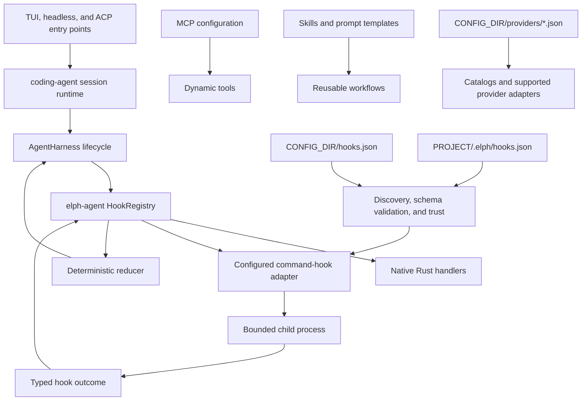
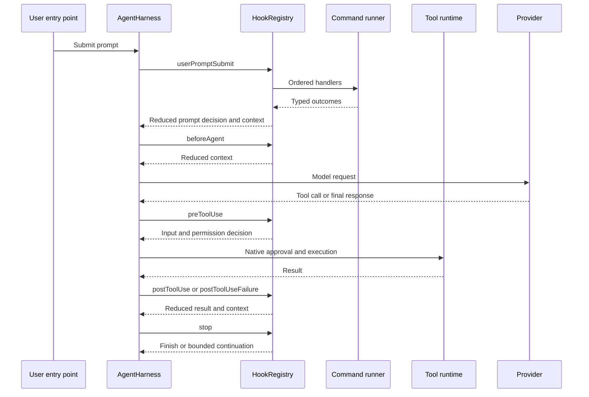

# Plan: Native Hooks Runtime and Complete Wasm Extension Removal

**Status:** approved for implementation  
**Compatibility policy:** clean break; no Wasm compatibility layer, deprecated settings, aliases, migrations, or legacy loaders  
**Primary owners:** `crates/elph-agent` for lifecycle semantics and `crates/coding-agent` for configuration, trust, process execution, and product integration

## Decision

Elph will use one hooks model:

- `elph-agent` owns typed lifecycle events, typed outcomes, and deterministic reducers.
- `coding-agent` loads JSON hook configuration and runs trusted external commands.
- MCP remains the extension point for dynamic tools.
- Skills and prompt templates remain the extension points for reusable workflows and user-invoked commands.
- `CONFIG_DIR/providers/*.json` remains the extension point for model catalogs and custom providers supported by an existing API adapter.
- Product UI and built-in slash commands remain native Rust code.

The Wasm extension runtime, PDK, example extension, dynamic extension tools, dynamic extension slash commands, and
extension-specific settings and CLI commands will be deleted completely.

This adopts lifecycle extensibility without copying Pi's TypeScript extension surface into Elph. It also avoids maintaining
two plugin systems with different security, lifecycle, and capability models.

## Architectural basis

The design combines the strongest applicable properties found during the comparison:

- [OpenAI Codex](https://github.com/openai/codex) treats lifecycle command execution as a host concern and keeps approval
  and sandbox enforcement in the native runtime.
- [Grok Build](https://github.com/xai-org/grok-build/tree/main/crates/codegen) models hook points around the code-generation
  lifecycle and uses explicit command execution rather than an in-process plugin ABI.
- [Pi](https://github.com/earendil-works/pi/tree/main/packages/coding-agent) has a broad TypeScript extension API, while its
  underlying agent loop already demonstrates the useful separation between lifecycle events and product-level extension
  capabilities.
- Elph already has typed native hooks in `crates/elph-agent/src/agent/harness/`. The implementation should strengthen that
  source of truth instead of introducing another event bus.

The upstream implementations are design references, not compatibility targets. Event names, payloads, and reducers must fit
Elph's Rust harness and security model.

## Goals

1. Provide deterministic lifecycle hooks for policy checks, validation, context injection, automation, and audit workflows.
2. Preserve one canonical event and outcome model for native Rust handlers and configured command handlers.
3. Keep all approval, sandbox, tool-schema validation, and provider authentication enforcement native to Elph.
4. Make executable project hooks visible, explicitly trusted, bounded, and diagnosable.
5. Remove all Wasm extension code and user-facing contracts, leaving no dormant feature flag or compatibility path.
6. Document the implemented JSON contract with a published schema and current configuration guide.

## Non-goals

- Loading Wasm, JavaScript, TypeScript, or shared-library plugins.
- Registering tools, providers, UI components, or slash commands from hooks.
- Replacing MCP with hooks.
- Adding an HTTP/webhook handler type.
- Running hooks in the background.
- Making hooks a security boundary or allowing hooks to bypass native policy.
- Reproducing Pi's extension API.
- Preserving old extension bundles, settings, commands, or session metadata.

## Target architecture



The command-hook adapter is a normal `HookRegistry` subscriber. The agent loop must not know about config paths, JSON Schema,
trust files, or child processes. Conversely, `coding-agent` must not duplicate hook reduction rules.

## Ownership boundaries

### `elph-agent`

Keep and evolve `agent::harness::HookRegistry` as the only lifecycle dispatcher. It owns:

- event and outcome types;
- handler registration and ordering;
- event-specific reducers;
- monotonic permission decisions;
- tool-input and tool-result validation after mutation;
- hook recursion prevention;
- stop-continuation limits;
- structured diagnostics returned to the host.

It must not:

- read `hooks.json`;
- resolve Elph config directories;
- persist product trust;
- spawn external hook commands;
- know about the TUI or CLI.

### `coding-agent`

Implement the product adapter in the existing empty `crates/coding-agent/src/platform/hooks/` module. It owns:

- home and project config discovery;
- JSON Schema validation and typed deserialization;
- project trust and hook-definition review;
- command resolution and child-process lifecycle;
- environment filtering, timeouts, output limits, and logging;
- registering command handlers with `AgentHarness`;
- `/reload`, doctor, TUI, headless, and ACP integration;
- user-facing status and errors.

Do not retain `crates/coding-agent/src/extensions/` as a renamed compatibility shell. Move only generally useful process or
trust primitives; delete extension-specific types and behavior.

## JSON configuration contract

### Locations

Use exactly two files:

1. `CONFIG_DIR/hooks.json`
2. `<project>/.elph/hooks.json`

Do not use an extension-style directory of manifests. The existing `hooks_dir()` path helper should be replaced with explicit
home and project `hooks.json` paths.

Home hooks run before project hooks. Arrays are concatenated in file order. Hook `id` values must be unique across the merged
configuration; a duplicate is a configuration error, not an override mechanism. A malformed file must not cause partially
loaded handlers from that file to run.

### Initial shape

```json
{
    "$schema": "https://elph.space/hooks-schema.json",
    "hooks": [
        {
            "id": "protect-sensitive-files",
            "event": "preToolUse",
            "matcher": {
                "toolNames": ["write_file", "apply_patch"]
            },
            "command": "hooks/protect-sensitive-files",
            "args": [],
            "timeoutMs": 5000,
            "enabled": true
        }
    ]
}
```

Contract rules:

- `id` is required, stable, non-empty, and unique after home/project composition.
- `event` is a closed enum. Unknown events fail validation.
- `command` is an executable path or a program resolved from `PATH`; Elph does not implicitly invoke a shell.
- `args` is an array of literal arguments. Users who need shell syntax must explicitly invoke their shell.
- A relative `command` path resolves against the directory containing the defining `hooks.json`.
- The child process working directory is the active project directory.
- `timeoutMs` defaults to `10000`, has a minimum of `1`, and is capped at `60000`.
- `enabled` defaults to `true`.
- `matcher.toolNames` uses the same exact, `prefix*`, and `*suffix` matching semantics as existing MCP tool policy.
- `matcher` is optional. An omitted matcher selects every occurrence of the event.
- In v1, only tool events accept `matcher.toolNames`. Do not add a generic expression language.
- No command interpolation is performed. Dynamic event data is supplied only through standard input.

The implementation may adjust field names before code is written only if the same change is made atomically in the Rust
types, schema, examples, and tests. It must not add speculative handler types or unimplemented fields.

### Required schema

Add `schemas/hooks-schema.json` using JSON Schema draft-07, matching the repository's existing schema convention:

- `$id`: `https://elph.space/hooks-schema.json`
- `additionalProperties: false` at every configuration object where the contract is closed;
- definitions for event, matcher, and hook command;
- required fields and numeric bounds matching the Rust deserializer;
- descriptions suitable for editor completion;
- a `$schema` property that is accepted and ignored by the runtime;
- conditional validation so tool-name matchers are accepted only for tool events.

Embed the schema in the hook config validator with `include_str!`, following the MCP validation pattern. Tests must prove
that the embedded schema and the typed Rust parser accept and reject the same fixtures.

The existing website build copies `schemas/*.json`, so the new schema will be published with the other schemas. Verify this
path rather than adding a second publishing mechanism.

## Lifecycle contract

Implement this bounded initial event set:

1. `sessionStart` — once after a new or resumed session is ready and before its first agent turn.
2. `userPromptSubmit` — after prompt expansion and before the user message enters the agent context.
3. `beforeAgent` — once per agent turn after context assembly and before the provider request.
4. `preToolUse` — after tool argument parsing and schema validation, before native approval and execution.
5. `postToolUse` — after a successful tool call, before its result is added to model context.
6. `postToolUseFailure` — after a failed tool call, before the failure is added to model context.
7. `preCompact` — before automatic or explicit compaction.
8. `postCompact` — after compaction succeeds.
9. `stop` — when the agent would otherwise finish a turn.
10. `sessionEnd` — once during orderly session shutdown.

Do not expose streaming token/message-update events to external commands. Their cadence would create unacceptable process
overhead and ambiguous mutation semantics.

Map existing Elph events into this vocabulary rather than publishing aliases. Remove or rename public hook event variants in
one clean change where necessary; no old-name adapter is required.



## Wire protocol

Each command receives one UTF-8 JSON object on standard input:

```json
{
    "event": "preToolUse",
    "hookId": "protect-sensitive-files",
    "sessionId": "018f...",
    "cwd": "/project",
    "payload": {
        "toolName": "write_file",
        "toolInput": {
            "path": ".env",
            "content": "..."
        }
    }
}
```

The event-specific `payload` is generated from typed Rust event data. Include only data required to make the decision. Never
include credentials, provider auth headers, the full transcript, or the complete process environment.

On exit code `0`, empty standard output means "no change." Non-empty standard output must be one event-specific JSON outcome.
Standard error is diagnostic text and is never parsed as an outcome.

Event outcomes are deliberately typed:

- Context events may return `additionalContext`.
- `userPromptSubmit` may return `allow` or `deny`, a reason, and additional context.
- `preToolUse` may return `allow`, `ask`, or `deny`, a reason, a complete replacement `toolInput`, and additional context.
- Post-tool events may return a replacement typed tool result and additional context.
- `stop` may return `allow` or `block`; a block requires a reason that is fed back to the model.
- Observation-only events return no mutation.

Represent these as event-specific Rust structs/enums. Do not deserialize into an open `serde_json::Value` and interpret fields
ad hoc.

## Reduction rules

All handlers run serially in effective configuration order. Determinism is more important than parallel hook throughput in
v1.

Use these rules:

- Additional context is appended in handler order with explicit source labels.
- Mutations compose sequentially; each handler sees the result of the preceding handler.
- Permission is a monotonic lattice: `allow < ask < deny`. A hook cannot loosen a decision already made by an earlier hook or
  native policy.
- `deny` is terminal for `userPromptSubmit` and `preToolUse`; remaining mutating handlers for that occurrence are skipped.
- A replacement tool input is validated against the registered tool schema before any approval or execution.
- A replacement tool result is validated against the internal tool-result contract before insertion into context.
- Invalid outcomes are discarded and reported; they never enter model context.
- A `stop` block starts another model turn with the supplied reason. Cap hook-driven continuations at eight per user turn.
- Hook-generated activity does not recursively emit the same external hook event.

Refactor existing "last non-`None` wins" reducers where they conflict with these rules. Add reducer tests before connecting
external commands so native and command handlers cannot diverge.

## Failure and resource policy

Configured hooks are automation, not Elph's security boundary. Native approval, sandbox, mode, MCP policy, and tool-schema
validation always remain authoritative.

- Spawn failure, timeout, signal termination, non-zero exit, malformed JSON, and invalid outcomes fail open for the agent
  operation, emit a structured diagnostic, and remain visible in logs/status.
- There is no configurable fail-open/fail-closed switch in v1.
- Kill the whole child process tree on timeout or cancellation, with platform-specific implementations behind `#[cfg]`.
- Limit stdin to 128 KiB, stdout to 64 KiB, stderr retained for diagnostics to 64 KiB, and returned additional context to
  32 KiB.
- Do not inherit stdin from the terminal.
- Start from a small environment allowlist required for process execution, then add non-secret Elph/session metadata with an
  `ELPH_HOOK_` prefix.
- Do not pass provider keys, auth-store values, or arbitrary `ELPH_*` secrets.
- Redact hook payloads from normal logs; log event, hook id, duration, exit status, and bounded error summaries.
- Cancellation of the parent run cancels the active hook process.

If a hook is intended to enforce organizational security, that enforcement belongs in native policy or sandbox code instead.

## Trust model

External command hooks execute with the user's OS permissions and are less isolated than the removed Wasm runtime. The UI and
documentation must state this directly.

- `CONFIG_DIR/hooks.json` is user-owned configuration and is trusted by source.
- Project hooks require the existing project-folder trust gate, generalized from extension-specific naming to executable
  project resources.
- Project hooks also require acceptance of the exact `hooks.json` content hash. A changed file returns project hooks to
  pending review until accepted again.
- The review view shows hook id, event, matcher, resolved command, arguments, timeout, source file, and definition hash.
- Hash acceptance protects against unnoticed definition changes; it does not sandbox the command or attest to scripts and
  programs referenced by the definition. Document this limitation.
- Untrusted or changed project hooks are skipped, never partially run, and reported by doctor and the session startup status.
- `/reload` revalidates configuration and trust. It must unregister the previous command-hook registrations before installing
  the new set.

Generalize extension-specific trust identifiers and methods directly. Do not retain aliases such as
`project_hooks_allowed`.

## Product behavior

### Tools

Hooks cannot register LLM tools. Dynamic tool servers use MCP. Built-in tools remain Rust implementations.

### Slash commands

Delete extension-provided slash-command registration, dispatch, collision handling, palette rows, and help text. Preserve:

- built-in Elph slash commands;
- prompt-template invocation;
- skill invocation.

Add only the minimum built-in hook operations needed for safe administration:

- `/hooks` lists active, skipped, pending, and failed hook definitions;
- `/hooks trust` reviews and accepts the current project hook-definition hash.

`/reload` reloads hooks together with the existing reloadable workspace resources. Hooks cannot add commands of their own.

### Providers

Hooks cannot register provider adapters or mutate provider authentication. Preserve and regression-test the current provider
JSON path:

- `CONFIG_DIR/providers/*.json` supplies catalog overlays and disk-only provider definitions;
- `/reload` refreshes changed provider files;
- disk-only providers work only when their `api` maps to an existing Elph adapter;
- unsupported APIs are diagnosed and skipped, not delegated to hooks.

Document this boundary beside the hook documentation so removal of Wasm is not mistaken for removal of custom provider JSON.

### UI

Hooks cannot register components, dialogs, keybindings, or transcript renderers. Native status UI may show hook execution and
review state, but there is no public UI extension API.

## Complete Wasm removal

Perform semantic removal, not a blind search-and-delete: protocol "extensions", file extensions, and unrelated uses of that
word must remain.

Delete or detach all of the following:

1. `crates/elph-agent/src/plugins/` and its exports, setters, tests, and feature gates.
2. The `wasmi` dependency, the `extensions` feature, and its membership in `full`.
3. `crates/coding-agent/src/extensions/` and all extension-host fields and arguments in runtime, startup, bridge, shell, view,
   keys, slash handling, and workspace reload.
4. `elph extensions ...`, its completion entries, doctor output, and CLI tests.
5. Extension tool and slash-command registration and dispatch.
6. `resources.extensions`, disabled-extension settings, extension path helpers, and extension-specific trust methods.
7. Extension-specific prompt/context-cache fingerprints and session metadata.
8. `crates/elph-extension-pdk/`, `crates/ext-hello/`, and their workspace exclusions.
9. `crates/elph-agent/tests/plugins.rs` and extension-only fixtures.
10. `docs/extensions.md` after its replacement documentation is complete.
11. `wasmi` and extension-only transitive packages from `Cargo.lock`.

Do not remove the native harness hooks. They are the foundation of the replacement.

## Implementation phases

### Phase 0: establish the baseline

1. Record `git status` and do not overwrite unrelated work.
2. Run the existing targeted and repository gates before structural changes.
3. Inventory all Wasm references by semantic category: runtime, product wiring, config, tests, docs, historical archive, or
   unrelated word use.
4. Confirm the current provider JSON and skills/prompt-template regression tests before removing extension wiring.

### Phase 1: make the native hook contract canonical

1. Define the final event and outcome enums in `elph-agent`.
2. Implement event traits or exhaustive matches for cadence, mutability, matcher support, and timeout class.
3. Replace ambiguous reducer behavior with the reduction rules in this plan.
4. Add focused unit tests for ordering, context composition, permission monotonicity, denial short-circuiting, mutation
   validation, recursion prevention, and stop limits.
5. Keep this phase independent of command execution.

Checkpoint: native handlers alone pass `elph-agent` checks, lint, and tests.

### Phase 2: implement JSON loading and the command runner

1. Add `schemas/hooks-schema.json`.
2. Add typed configuration and embedded schema validation under `platform/hooks/`.
3. Implement home/project composition and duplicate-id rejection.
4. Implement matcher compilation using the existing MCP wildcard semantics.
5. Implement the bounded, cancellable, cross-platform child-process runner.
6. Implement typed stdin payloads and event-specific stdout outcomes.
7. Register command adapters through the canonical `HookRegistry`.

Checkpoint: parser, schema, matcher, process, timeout, limit, and cancellation tests pass without TUI involvement.

### Phase 3: wire lifecycle points

1. Wire each event once at its documented lifecycle boundary.
2. Verify identical behavior in TUI, headless, and ACP entry paths.
3. Ensure tool input is revalidated before native approval and execution.
4. Ensure provider calls, tool execution, compaction, and shutdown do not emit duplicate events.
5. Ensure cancellation and abrupt failure do not falsely report `sessionEnd` as an orderly shutdown.

Checkpoint: lifecycle integration tests assert exact event order and payload boundaries.

### Phase 4: trust, reload, and observability

1. Generalize project trust from extension-specific concepts.
2. Persist and compare project `hooks.json` definition hashes.
3. Add review/status output and the built-in `/hooks` operations.
4. Update `/reload` to atomically replace registrations only after the new configuration validates.
5. Update doctor and structured logs.
6. Verify that untrusted, changed, malformed, and timed-out hooks are visible but do not brick a session.

Checkpoint: trust and reload tests cover first load, acceptance, unchanged reload, changed definitions, rejection, and removal.

### Phase 5: remove Wasm and simplify product APIs

Remove product wiring from the leaves inward:

1. Remove dynamic extension tools and slash commands from callers.
2. Simplify runtime, startup, bridge, shell, and reload signatures.
3. Remove extension CLI/settings/paths/trust code.
4. Remove `coding-agent` extension modules.
5. Remove `elph-agent` plugin modules, feature flags, and dependencies.
6. Delete the PDK and example crates and clean root workspace exclusions.
7. Refresh the lockfile through the repository's `make` targets.
8. Run a semantic residue audit.

Do not create temporary public shims to keep intermediate commits compatible. Keep checkpoints buildable by ordering removals
from consumers to providers.

### Phase 6: update current documentation

Create `docs/hooks.md` only after behavior is implemented. It must include:

- the architecture and lifecycle diagrams from this plan, corrected to match final code;
- config locations and composition;
- a schema-linked example;
- every event's timing, input, output, and reduction behavior;
- command resolution, working directory, environment, timeout, and size limits;
- project trust and hash-review workflow;
- `/hooks`, `/reload`, doctor, TUI, headless, and ACP behavior;
- failure behavior and troubleshooting;
- explicit boundaries for MCP tools, skills/templates, provider JSON, slash commands, and UI;
- a warning that native commands are not sandboxed like Wasm.

Delete `docs/extensions.md`. Update all current documentation that claims Wasm or dynamic extension support, including at
least:

- `docs/settings.md`;
- `docs/elph-agent.md`;
- `docs/ci.md`;
- `docs/context-caching.md`;
- `docs/porting/feature-comparison.md`;
- the current-state sections of `docs/porting/pi-coding-agent.md`;
- `docs/agent-harness.md`, `docs/tools.md`, and `docs/durable-harness.md` where their contracts are affected;
- `crates/elph-agent/README.md`;
- the active changelog/release notes.

Do not rewrite historical archive documents merely to erase old history. Mark historical Wasm descriptions as superseded
where readers could mistake them for current behavior.

### Phase 7: update the canonical configuration guide

The hook configuration is incomplete until `docs/archive/configuration.md` is updated. Add:

1. `hooks.json` to the configuration/storage path summary.
2. A dedicated `hooks.json` section after the general JSON section.
3. The correct schema link:
   `[schemas/hooks-schema.json](../../schemas/hooks-schema.json)`.
4. Home/project locations and composition rules.
5. The complete field contract and a validated example.
6. Event, matcher, ordering, and reducer summaries.
7. Trust, hash review, native-code risk, environment filtering, timeout, and output-limit behavior.
8. `/hooks` and `/reload` operational behavior.
9. The MCP/skills/templates/providers separation of responsibilities.

Although this file is under `docs/archive/`, it is explicitly required as the repository's comprehensive configuration
reference. Its hook section must describe shipped code, not this plan.

### Phase 8: final verification

Run all commands through `make`, never direct `cargo`:

```sh
make fmt
make check
make lint
make test
```

Also run targeted all-feature gates for affected crates through the corresponding `make` targets. The removed `extensions`
feature must not appear in any feature matrix.

Perform explicit residue checks:

- no `wasmi` package in Cargo metadata or `Cargo.lock`;
- no `extensions` feature in `elph-agent`;
- no Wasm plugin/PDK/example source remains;
- no extension CLI, settings, path, trust, or host symbol remains;
- no current documentation advertises Wasm extensions;
- unrelated MCP protocol extensions and file-extension terminology remain intact;
- `schemas/hooks-schema.json` is valid JSON, formats with `make fmt`, and is copied by the website build;
- every documented hook example validates against the schema;
- provider JSON, MCP tools, skills, and prompt templates still work.

Cross-platform CI must exercise Linux, macOS, and Windows command execution. Unix-only process-group code and Windows job
object/process-tree code must be cfg-gated with tests appropriate to each platform.

## Test plan

### `elph-agent` unit tests

- stable registration order;
- context concatenation order;
- `allow < ask < deny` monotonicity;
- denial short-circuiting;
- sequential tool-input replacement;
- schema rejection of invalid replaced input;
- typed tool-result replacement;
- recursion suppression;
- stop continuation limit;
- native handler error isolation.

### `coding-agent` unit tests

- home-only, project-only, and composed config;
- duplicate ids across sources;
- unknown fields and events;
- invalid matcher/event combinations;
- disabled handlers;
- relative command resolution;
- wildcard matching;
- project trust and changed hash;
- atomic reload;
- payload redaction and environment filtering.

### Portable process integration tests

Use a Rust test-helper executable rather than assuming a POSIX shell. Cover:

- JSON stdin and typed JSON stdout;
- empty stdout;
- stderr diagnostics;
- non-zero exit;
- malformed and oversized output;
- timeout and process-tree termination;
- parent cancellation;
- project working directory using a sentinel file;
- secret environment exclusion.

Gate genuinely OS-specific process-tree assertions and explain why.

### Product integration tests

- exact lifecycle event order for successful and failing tool calls;
- TUI, headless, and ACP use the same registered hooks;
- untrusted hooks never execute;
- `/hooks` and `/reload` reflect active registrations;
- prompt templates and skills still provide user-invoked workflows;
- MCP remains the only dynamic tool registration path;
- disk-only custom provider JSON still loads for each supported API family;
- unsupported provider APIs produce the existing clear diagnostic.

## Acceptance criteria

The work is complete only when:

1. A validated home or trusted project `hooks.json` can observe and influence the documented lifecycle events.
2. Native and command handlers use the same typed events, outcomes, ordering, and reducers.
3. Hook failures are bounded, visible, cancellable, and cannot bypass native policy or inject invalid tool data.
4. Changed project hook definitions cannot execute without renewed hash acceptance.
5. No Wasm extension runtime, feature, dependency, PDK, example, user command, setting, or current documentation remains.
6. Dynamic tools work through MCP, workflows through skills/templates, and supported custom providers through provider JSON.
7. `schemas/hooks-schema.json`, `docs/hooks.md`, and `docs/archive/configuration.md` agree with the final Rust contract.
8. All repository format, check, lint, test, schema, documentation, and cross-platform gates pass.

## Agent execution notes

- Start by rereading this plan and the current source; paths may move before execution.
- Preserve unrelated concurrent edits.
- Prefer deleting obsolete concepts over renaming them into generic plugin abstractions.
- Keep the hook event model exhaustive and typed; avoid stringly typed internal dispatch.
- Do not add compatibility aliases or parse old extension configuration.
- Do not broaden v1 with HTTP hooks, background execution, custom event expressions, or hook-provided tools/UI/commands.
- Update documentation from the final diff, not from this planned shape.
- If implementation reveals a security or product tradeoff that changes the trust or failure rules above, stop and request a
  decision instead of silently adding a configuration switch.
