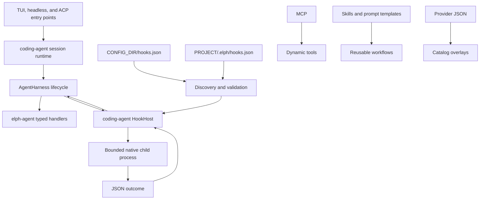

# Native hooks implementation record

**Status:** implemented
**Compatibility policy:** clean break; the former WASM extension surface was
removed without compatibility loaders, aliases, migrations, or deprecated
settings.

This document records the completed implementation. The user-facing contract
is maintained in [`docs/hooks.md`](../hooks.md); the machine-readable
configuration contract is [`schemas/hooks-schema.json`](../../schemas/hooks-schema.json).

## Decision

Elph has one lifecycle extensibility model:

- `elph-agent` owns typed lifecycle events and native handler registration.
- `coding-agent` loads JSON hook configuration and executes external commands.
- MCP remains the extension point for dynamic tools.
- Skills and prompt templates remain the extension points for reusable
  instructions and user-invoked workflows.
- `CONFIG_DIR/providers/*.json` remains the extension point for model catalogs
  and custom providers supported by an existing API adapter.
- Product UI and built-in slash commands remain native Rust code.

Hooks cannot register tools, providers, UI components, or slash commands. This
keeps approval, sandbox, authentication, and tool-schema enforcement inside
Elph's native runtime.

## Implemented architecture

`elph-agent` does not read configuration files or spawn commands. The
`coding-agent` adapter owns discovery, project trust, command execution,
timeouts, output bounds, diagnostics, and registration with the harness.

## Current configuration contract

Exactly two files are loaded, in this order:

1. `CONFIG_DIR/hooks.json`
2. `<project>/.elph/hooks.json`, only after the project trust gate allows
   executable resources

The hook arrays are appended in file order. IDs must be unique across the
merged configuration. A malformed file is skipped as a unit, and disabled
hooks are not registered.

Commands are executed directly. Elph does not invoke a shell implicitly;
relative command paths resolve against the defining configuration file, while
the child process uses the active project directory as its working directory.
Shell syntax requires an explicit shell command and literal `args`.

The schema accepts the following event names:

`sessionStart`, `userPromptSubmit`, `beforeAgent`, `preToolUse`,
`postToolUse`, `postToolUseFailure`, `preCompact`, `postCompact`, `stop`, and
reserved `sessionEnd`.

`sessionEnd` is reserved in the schema but is not emitted by the current ACP
session owner. Tool events support optional exact, `prefix*`, or `*suffix`
matching through `matcher.toolNames`.

## Command and failure policy

- JSON is sent on stdin and one optional JSON outcome is read from stdout.
- Stderr is diagnostic text and is never parsed as an outcome.
- Commands run serially in configuration order.
- Spawn errors, non-zero exits, timeouts, malformed JSON, and oversized output
  fail open for the current operation and are reported diagnostically.
- Input is limited to 128 KiB; stdout and stderr to 64 KiB; returned context to
  32 KiB; timeouts default to 10 seconds and are capped at 60 seconds.
- Native approval, sandbox, MCP policy, authentication, and schema validation
  remain authoritative. Hooks are not a security boundary.

## Product integration

- `/reload` replaces the active hook configuration after parsing the new files.
- `elph doctor` reports hook configuration and project-trust diagnostics.
- TUI, headless, and ACP sessions bind the same `HookHost` adapter.
- Custom slash commands and custom UI registration remain intentionally out of
  scope; prompt templates and skills cover user-invoked workflows.

## Removed surface

The clean-up removed the former:

- WASM/wasmi host and guest ABI;
- extension PDK and example guest;
- extension registry, discovery, UI bridge, and plugin tests;
- extension-specific settings, paths, CLI commands, and manifests;
- extension-provided tools and slash commands.

Historical design notes remain under [`docs/archive/`](../archive/README.md) so
past decisions stay traceable. They are not current APIs.
