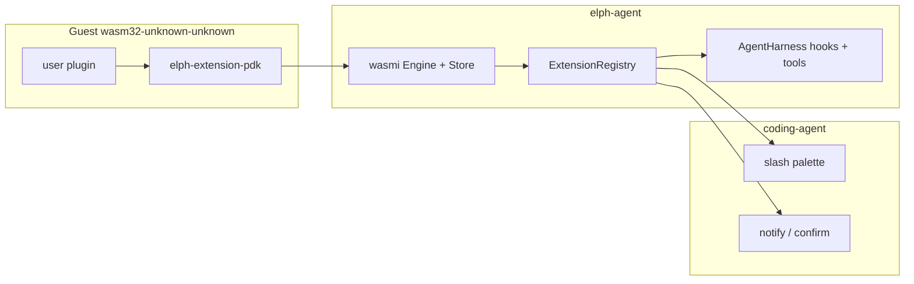

# Wasmi plugin host with Pi-shaped customization

Replace wasmtime/WIT with **wasmi**. Design the guest ABI after **Zellij** (host functions + subscribe + JSON). Expose the **Pi ExtensionAPI capability map** users actually write extensions for — not TypeScript-in-process, not slash-only.

No dual path, no migration of `component.wasm` / `extension.toml` `component` field.

## What “flexible like Pi” means here

Pi’s power is the **API**, not jiti:

- `registerCommand` / `registerTool`
- `pi.on(event)` across session, agent, and tool lifecycle
- `ctx.ui.confirm` / `notify` (permission gates are the canonical example)
- hot `/reload`, global + project-local discovery

Elph already has the **host** half of that in Rust: `AgentHarness` typed hooks (`on_tool_call`, `on_before_agent_start`, `on_tool_result`, session compact/tree, …). Native code (memory, skills) uses it. Users cannot ship that without rebuilding Elph.

Zellij shows the **runtime** half: wasmi, no JIT cache, plugin instance on a mutex/pinned thread, events in, host commands out, WASI optional.

This change connects those two: Wasm guests call the same harness surfaces Pi extensions call, through a small host-function ABI.

**Not in scope (and not promised):** loading Pi `*.ts` / npm / `node:fs`. That is a Node sidecar, which contradicts sandbox. TypeScript guests later compile to this same core Wasm (e.g. `extism-js`); they still only see host imports.



## Runtime (wasmi)

- Workspace: drop `wasmtime`. Pin `wasmi = "2.0.0-beta.10"`. Feature `extensions = ["dep:wasmi", "dep:walkdir"]`.
- One `Engine` per registry; fuel on. No `wasmi_wasi`.
- `LoadedExtension`: `Module` + `Mutex<Store+Instance>`. Instantiate once at load.
- Limits: 16 MiB memory (`trap_on_grow_failure`), fuel reset per guest call (~10M).
- Guest target `wasm32-unknown-unknown`. Modules that import WASI fail load with a clear error.
- Delete `crates/elph-agent/wit/` and all `bindgen!` / Cranelift paths.

## ABI (Zellij-shaped, Pi-named)

Linear memory protocol: host/guest pass **u32 LE length + UTF-8 JSON** (max 64 KiB). `elph_alloc` / `elph_dealloc` exported by the guest. Pointer `0` is failure.

**Guest exports**

- `memory`, `elph_alloc`, `elph_dealloc`
- `elph_init()` — guest registers commands/tools/subscriptions via host imports
- `elph_on_event(ptr, len) -> ptr` — JSON `{ "event": "<name>", "payload": ... }` in; optional patch JSON out
- `elph_execute_command(name_ptr, name_len, args_ptr, args_len) -> ptr` → `{ "message", "is_error" }`
- `elph_execute_tool(ptr, len) -> ptr` — `{ "name", "tool_call_id", "input" }` → tool result JSON

**Host imports (`elph` module)** — guest-callable, capability-based:

- `register_command({ name, description })`
- `register_tool({ name, label, description, parameters })` — JSON Schema object, same idea as Pi `Type.Object`
- `subscribe(["tool_call", ...])`
- `notify({ message, level })`
- `confirm({ title, body }) -> bool` — blocks the Wasm call until the UI answers

Events are **string-named JSON**. Adding a Pi event later does not change exports. Unknown event names: host does not subscribe; guest ignores unknown payloads.

## Pi surface in this change (not the entire Pi docs)

Wire only what Elph harness already mutates, plus UI needed for real extensions:

| Pi                         | Elph landing                                                                             |
| -------------------------- | ---------------------------------------------------------------------------------------- |
| `registerCommand`          | slash registry (existing dispatch; built-ins still win)                                  |
| `registerTool`             | harness tool list; `elph_execute_tool` on call                                           |
| `on("session_start")`      | after session bind / `/reload`                                                           |
| `on("before_agent_start")` | `AgentHarness::on_before_agent_start` — guest may return `{ system_prompt?, messages? }` |
| `on("tool_call")`          | `on_tool_call` — `{ block, reason }`; payload includes `tool_name`, `input`              |
| `on("tool_result")`        | `on_tool_result` — optional patch                                                        |
| `ctx.ui.notify`            | TUI/status line (no-op in print/json if no UI)                                           |
| `ctx.ui.confirm`           | TUI modal; in non-TUI, default **deny** (safe)                                           |

Deferred (ABI allows later, do not implement now): `registerShortcut` / `registerFlag` / `registerProvider`, `ctx.ui.custom` / iocraft-in-guest, `sendMessage` / `appendEntry`, session fork/switch, `before_provider_request`, npm/git install, TS compiler.

Payloads stay **small**. Zellij’s wasmi regression was huge event blobs, not the interpreter. `tool_call` sends tool name + args, not the full transcript.

## Host wiring

`elph-agent` `src/plugins/`:

- Keep discovery (`~/.elph/extensions/`, `.elph/extensions/` after trust), `extension.toml`, enable/disable.
- Manifest: `wasm = "plugin.wasm"` (replace `component`).
- After instantiate, call `elph_init`; collect registrations into registry state.
- `bind_to_harness(&self, harness: &AgentHarness)` registers one host-side hook per subscribed event that fans out to matching guests in load order (same chaining semantics as Pi / current harness).
- Tool wrapper: `simple_tool` (or equivalent) whose execute calls `elph_execute_tool` under the extension mutex.
- Inject `ExtensionUi` trait (`notify`, `confirm`) from coding-agent; agent crate does not talk to iocraft directly.

`coding-agent`:

- On session start and `/reload`, load registry then `bind_to_harness`.
- Slash path unchanged aside from command source.
- Confirm: oneshot from plugin thread → TUI → reply. Guest sees a sync host function (Zellij model). Run guest calls in `spawn_blocking` so the tokio agent loop is not stuck in the interpreter; confirm still needs a UI slot.

## Guest PDK + examples

Excluded crates (do not join host `cargo test`):

- `crates/elph-extension-pdk` — alloc, JSON, `init` helpers, `on`, `command`, `tool`, `ui::{notify,confirm}`.
- Rewrite `crates/ext-hello`:
    1. `/say-hello` command (parity with today).
    2. `tool_call` gate: confirm before `shell_exec` containing `rm -rf` — the Pi poster child.

Build: `cargo build --release --target wasm32-unknown-unknown`. No `cargo-component`, no `wit-bindgen`.

## Tests

`tests/plugins.rs` (`extensions` feature):

- Manifest `wasm` field; discovery; WASI-import module rejected.
- In-test `.wat` (dev-dep `wat`): `elph_init` registers a command; `execute_command`; `on_event` for `tool_call` returns `{ block: true }`.
- Harness bind: extension blocks a tool call through `on_tool_call`.

No checked-in `.wasm` required for CI. Optional local build of `ext-hello`.

## Cleanup

Remove wasmtime workspace dep, WIT, generated `ext-hello` bindings, `cargo-component` docs. CLI about-text: wasmi core Wasm. `docs/ci.md`: stop blaming wasmtime for Windows timeouts.

## Docs

New [`docs/extensions.md`](docs/extensions.md) (English, current code): discovery, trust, ABI, host imports, events in this ship, PDK, limits, how this maps to Pi (`registerTool` → host import, not jiti). Explicit: **not** source-compatible with Pi TypeScript.

Update [`docs/elph-agent.md`](docs/elph-agent.md), [`crates/elph-agent/CHANGELOG.md`](crates/elph-agent/CHANGELOG.md), archive/porting strings that still say wasmtime/Component Model.

## Verify

```sh
make fmt
make check -- -p elph-agent --features extensions
make lint -- -p elph-agent --features extensions
make test -- -p elph-agent --features extensions
make check
```

## Risks

- `confirm` during a live agent turn is the hardest UI piece; if TUI plumbing slips, ship `notify` + confirm-deny-in-headless first, keep the host import so guests compile.
- wasmi 2.0 is beta; pin exact version.
- Do not dump `AgentState` into Wasm; keep JSON patches tiny.
