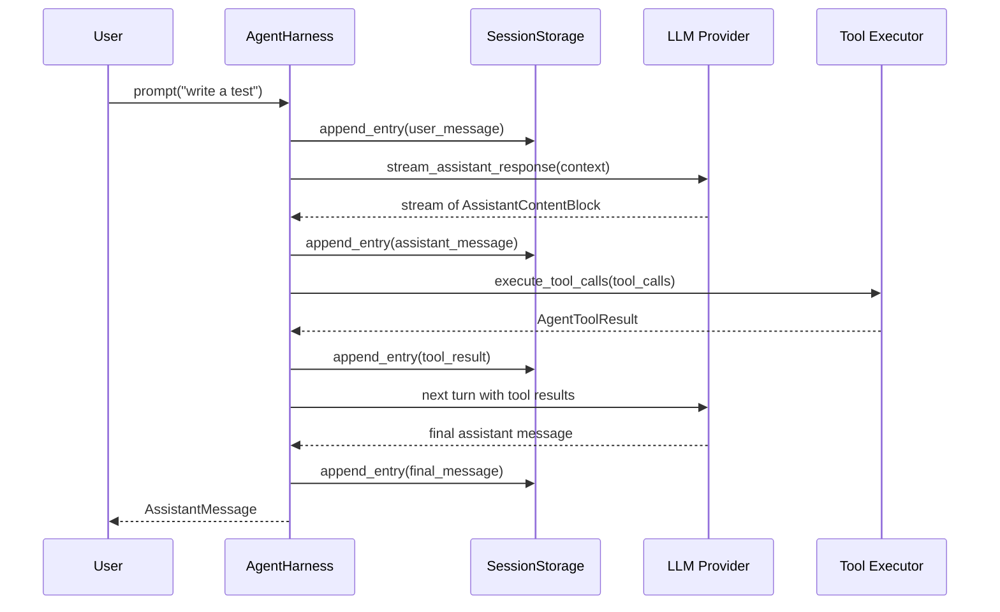

# Architecture Overview

## Crate Dependency Graph

```
                ┌─────────────────────────────────────────────────┐
                │                   elph (product)                │
                │  CLI · TUI (iocraft) · Agent wiring · Memory   │
                └──────┬──────────┬────────────┬─────────────────┘
                       │          │            │
          ┌────────────┘          │            └──────────────┐
          ▼                       ▼                           ▼
   ┌──────────────┐    ┌──────────────────┐        ┌──────────────────┐
   │  elph-agent  │◄───│    elph-ai       │        │    elph-tui      │
   │ Agent runtime │    │ LLM providers,   │        │ iocraft widgets, │
   │ Harness, MCP  │    │ auth, models     │        │ markdown, diff   │
   │ Compaction,   │    │ streaming, retry │        │ text editing     │
   │ Skills, Tools │    └──────────────────┘        └──────────────────┘
   └──────┬────────┘
          │
          ▼
   ┌──────────────┐
   │  elph-exec   │
   │ Shell, PTY   │
   └──────────────┘
```

- `elph-agent` depends on `elph-ai` for all LLM communication.
- `elph-agent` depends on `elph-exec` for shell execution and PTY.
- `elph` (product) depends on `elph-agent` (with `full` features), `elph-ai`, `elph-tui`, and `floppy`.

## Agent Loop Phases

The agent loop runs inside `AgentHarness<S>` (defined in `crates/elph-agent/src/agent/harness/mod.rs`). The harness wraps a generic `SessionStorage` backend (`S`). See the detailed [Agent Loop](../workflows/agent-loop.md) page for the full turn cycle.

```
┌─────────────────────────────────────────────────────────────────┐
│                        AgentHarness<S>                          │
│                                                                 │
│  Phase: Idle ──► Turn ──► (Compaction | BranchSummary | Retry) ──► Idle  │
│                                                                 │
│  Inner loop (runtime/run_loop.rs):                               │
│    stream_assistant_response() ──► execute_tool_calls()          │
│        ──► prepare_next_turn() ──► drain steering/follow-up      │
│        ──► repeat until StopReason::EndTurn / Stop / MaxTokens   │
└─────────────────────────────────────────────────────────────────┘
```

Key phases (`AgentHarnessPhase` enum from `harness/types.rs`):

| Phase         | Description                                                                         |
| ------------- | ----------------------------------------------------------------------------------- |
| `Idle`        | Ready for next prompt. Guards `prompt()` and `skill()` entry.                       |
| `Turn`        | Main turn execution. Runs `create_turn_state()` → `execute_turn()`.                 |
| Compaction    | Background context window compaction. See [Compaction](../workflows/compaction.md). |
| BranchSummary | Branch summarization for multi-turn sessions.                                       |
| Retry         | Automatic retry on transient provider errors.                                       |

### Turn Execution Flow

`AgentHarness::prompt()` (from `prompt_ops.rs`):

1. **Guard**: Asserts phase is `Idle`, sets phase to `Turn`.
2. **`begin_run()`**: Emits `AgentHarnessEvent::Started`.
3. **`create_turn_state()`**: Builds `TurnState` with session context, skills, tool registry.
4. **`execute_turn()`**: Calls `run_agent_loop()` from `runtime/run_loop.rs`.
5. **`finish_run()`**: Emits completion event, phase back to `Idle`.

The inner loop (`runtime/run_loop.rs`) iterates:

```
loop {
    // 1. Drain steering messages
    // 2. stream_assistant_response() — SSE/streaming from provider
    // 3. Extract tool calls, if any
    // 4. execute_tool_calls() — run each tool, collect results
    // 5. If stop_reason is EndTurn/Stop/MaxTokens, break
    // 6. Otherwise, feed tool results back and continue
}
```

## Session Persistence

`AgentHarness` is generic over `S: SessionStorage + Clone + Send + Sync + 'static`. The product uses `SessionDirStorage` (Turso-based flat-file session store).

Session entries are stored as a tree (`SessionTreeEntry` enum):

- `Message { message, metadata }` — LLM messages
- `ToolResult { tool_name, result, metadata }` — tool execution results
- `Summary { summary, metadata }` — compaction summaries

The `SessionStorage` trait (from `crates/elph-agent/src/session/types.rs`) defines:

- `append_entry()`, `append_entries()`
- `read_tree()` / `read_tree_since()`
- `build_context_with_options()` — session context for prompts
- `get_path_to_root_or_compaction()` — for context window slicing

## Key Traits

| Trait             | Location                                       | Purpose                                                               |
| ----------------- | ---------------------------------------------- | --------------------------------------------------------------------- |
| `AgentHarness`    | `crates/elph-agent/src/agent/harness/`         | Hook-rich agent orchestration                                         |
| `SessionStorage`  | `crates/elph-agent/src/session/types.rs`       | Session persistence backend                                           |
| `CredentialStore` | `crates/elph-ai/src/auth/`                     | API key + OAuth credential storage — see [Auth](../workflows/auth.md) |
| `ModelsStore`     | `crates/elph-ai/src/auth/models_store.rs`      | Dynamic provider catalog storage — see [Auth](../workflows/auth.md)   |
| `ProviderStreams` | `crates/elph-ai/src/providers/adapter.rs`      | Provider API adapter trait — see [Providers](../domains/providers.md) |
| `ExecutionEnv`    | `crates/elph-agent/src/agent/harness/types.rs` | Filesystem and shell execution — see [Tools](../domains/tools.md)     |

## Session Persistence Lifecycle



## Source References

- `crates/elph-agent/src/agent/harness/mod.rs` — harness module structure
- `crates/elph-agent/src/agent/harness/prompt_ops.rs` — `prompt()` and `skill()` entry points
- `crates/elph-agent/src/runtime/run_loop.rs` — core turn iteration
- `crates/elph-agent/src/session/types.rs` — `SessionStorage` trait
- `crates/elph-agent/src/agent/harness/types.rs` — `AgentHarnessPhase`, `AgentHarnessError`, `CompactionSettings`
