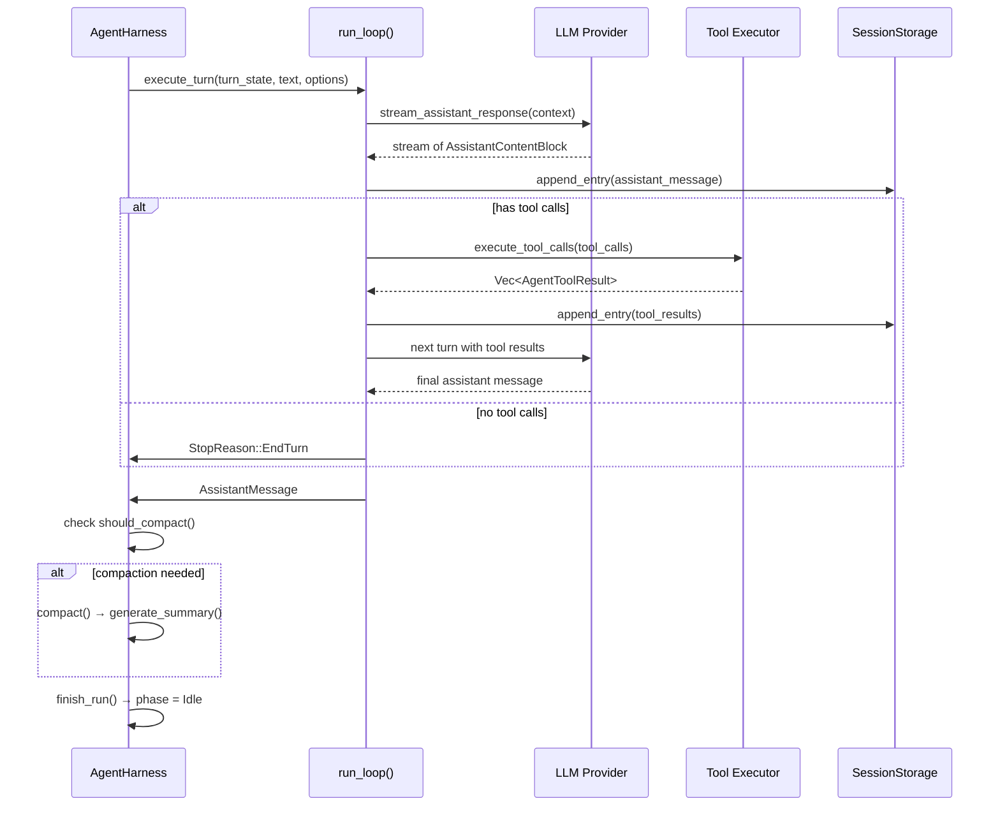

# Agent Loop

The agent loop is the core turn execution engine. It lives in two layers:

1. **`AgentHarness<S>`** (`crates/elph-agent/src/agent/harness/`) — hook-rich orchestration with session persistence, event emission, and compaction. See [Architecture Overview](../architecture/overview.md) for the harness structure.
2. **`run_agent_loop()`** (`crates/elph-agent/src/runtime/run_loop.rs`) — the inner turn iteration that streams LLM responses, executes tools, and repeats. The harness's `run_loop/` directory (`crates/elph-agent/src/agent/harness/run_loop/`) provides the turn execution layer that wraps this inner loop with session persistence, event emission, and compaction.

## Entry Point: `AgentHarness::prompt()`

Defined in `crates/elph-agent/src/agent/harness/prompt_ops.rs`:

```rust
pub async fn prompt(
    &self,
    text: impl Into<String>,
    options: Option<AgentHarnessPromptOptions>,
) -> HarnessOpResult<AssistantMessage> {
    // 1. Guard: must be Idle phase
    // 2. Set phase = Turn
    // 3. begin_run() — emit events
    // 4. create_turn_state() — build context, load resources
    // 5. execute_turn() — run the inner loop
    // 6. finish_run() — emit completion
}
```

## Inner Loop: `run_loop()`

Defined in `crates/elph-agent/src/runtime/run_loop.rs`:

```rust
pub(super) async fn run_loop(
    current_context: &mut AgentContext,
    new_messages: &mut Vec<AgentMessage>,
    config: &mut AgentLoopConfig,
    signal: Option<CancellationToken>,
    emit: &AgentEventCallback,
) -> Result<(), String> {
    // Outer loop: multi-turn with steering messages
    loop {
        // Inner loop: tool call cycles
        while has_more_tool_calls || !pending_messages.is_empty() {
            // 1. Drain steering/follow-up messages
            // 2. stream_assistant_response() — SSE stream from provider
            // 3. Extract tool calls from response
            // 4. execute_tool_calls() — run each tool, collect results
            // 5. If stop_reason is EndTurn/Stop/MaxTokens, break
            // 6. Feed tool results back into context
        }
    }
}
```

## Turn Cycle Diagram



## Key Events

Emitted throughout the turn via `AgentEvent` enum (`crates/elph-agent/src/types/enums.rs`):

| Event                                     | Description                 |
| ----------------------------------------- | --------------------------- |
| `AgentStart`                              | Agent loop begins           |
| `AgentEnd`                                | Agent loop ends             |
| `TurnStart`                               | New turn starts             |
| `TurnEnd { message, tool_results }`       | Turn completes              |
| `MessageStart { message }`                | Message appended to context |
| `MessageEnd { message }`                  | Message fully processed     |
| `ToolExecutionStart { tool_name }`        | Tool begins execution       |
| `ToolExecutionEnd { tool_name, result }`  | Tool completes              |
| `ToolExecutionError { tool_name, error }` | Tool fails                  |

## Tool Execution Pipeline

Defined in `crates/elph-agent/src/runtime/exec/`:

1. `execute_tool_calls()` — iterates each tool call, spawns concurrent execution.
2. `ExecutedToolBatch` — collects results, tracks `added_tool_names`, `usage`.
3. `fail_tool_calls_from_truncated_message()` — handles truncation edge cases.
4. Results are patched back into the context via `ToolResultPatch`.

### BeforeToolCallResult.terminate (commit `f398e03`)

`BeforeToolCallResult` in `crates/elph-agent/src/runtime/loop_config.rs` added:

```rust
pub struct BeforeToolCallResult {
    pub block: bool,
    pub reason: Option<String>,
    pub args: Option<Value>,
    /// Hint that the agent should stop after the current tool batch when this
    /// call is blocked. Early termination only happens when every finalized tool
    /// result in the batch sets this to true.
    pub terminate: Option<bool>,
}
```

When `terminate: Some(true)` is set on every blocked tool call in a batch, the agent loop stops after the current batch instead of continuing. Used by plan mode tool blocking in `crates/elph-agent/src/agent/harness/run_loop/loop_config.rs`.

Tools are registered as `AgentTool` instances. See [Tools](../domains/tools.md) for built-in tools and feature flags, and [MCP](../domains/mcp.md) for MCP-bridged tools.

## Steering and Follow-up Messages

The loop supports `get_steering_messages` and `get_follow_up_messages` callbacks on `AgentLoopConfig`:

- Steering messages are prepended at the start of each turn.
- Follow-up messages are injected after tool execution.
- Both are drained via `pending_messages`.

## Source References

- `crates/elph-agent/src/agent/harness/prompt_ops.rs` — `prompt()`, `skill()`, queue management
- `crates/elph-agent/src/agent/harness/run_loop/` — run loop sub-modules (loop_config, queue_drain, session_writes, turn_execution)
- `crates/elph-agent/src/runtime/run_loop.rs` — core turn iteration
- `crates/elph-agent/src/runtime/stream.rs` — `stream_assistant_response()`
- `crates/elph-agent/src/runtime/exec/execute.rs` — `execute_tool_calls()`
- `crates/elph-agent/src/runtime/exec/messages.rs` — tool result to message conversion
- `crates/elph-agent/src/runtime/loop_config.rs` — `AgentLoopConfig`, `AgentContext`, `AgentEvent`
- `crates/elph-agent/src/agent/harness/types/events.rs` — `AgentEvent`, `StopReason`, `QueueMode`
