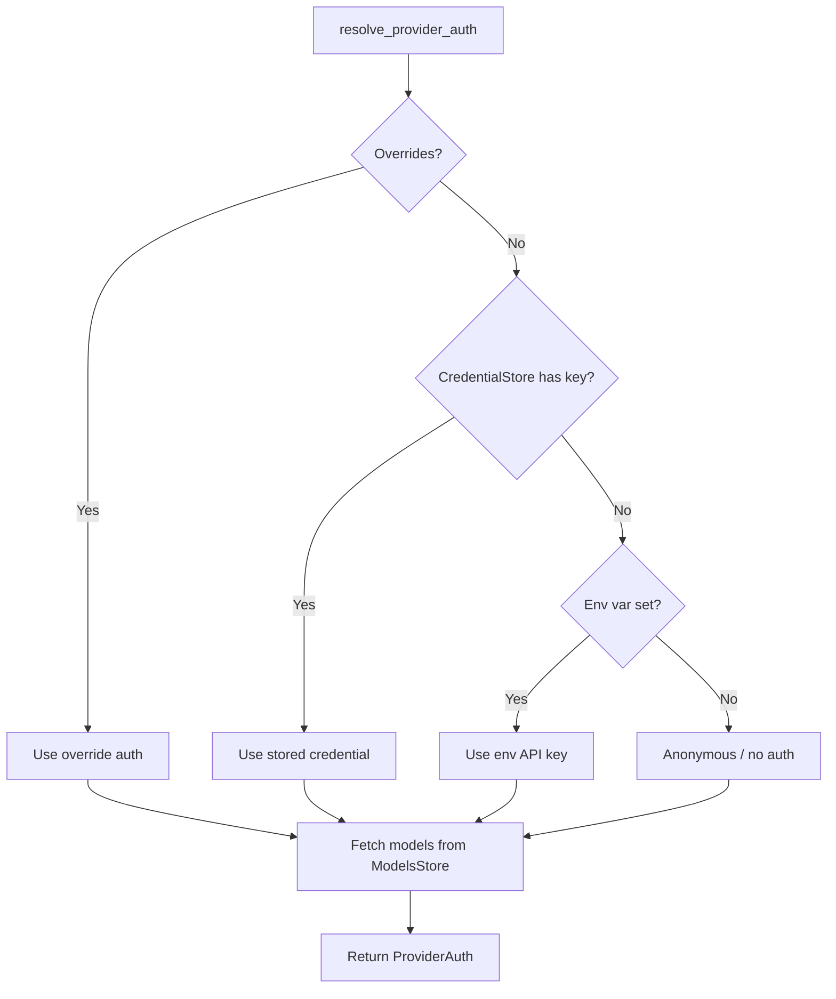

# Auth

Auth lives in `crates/elph-ai/src/auth/`. It handles API key credentials, OAuth flows, and dynamic provider model catalogs. Auth resolution is a key part of the [Provider](../domains/providers.md) system — each provider adapter uses `resolve_provider_auth()` to authenticate before making API calls. See [Architecture Overview](../architecture/overview.md) for how auth integrates into the agent harness.

## Module Structure

```
crates/elph-ai/src/auth/
├── mod.rs                 — re-exports
├── types.rs               — Credential, AuthContext, AuthResult, CredentialInfo, ProviderAuth, ModelAuth
├── credential_store.rs    — CredentialStore trait, InMemoryCredentialStore
├── models_store.rs        — ModelsStore trait, InMemoryModelsStore, ProviderStore, ModelsStoreEntry
├── resolve.rs             — resolve_provider_auth(), AuthResolutionOverrides, ModelsError
├── context.rs             — DefaultAuthContext, default_auth_context()
├── helpers.rs             — env_api_key_auth(), OAuthLoader, lazy_oauth()
└── oauth/                 — OAuth provider implementations
```

## CredentialStore

The `CredentialStore` trait (from `types.rs`):

```rust
pub trait CredentialStore: Send + Sync {
    async fn get(&self, provider_id: &str, key: &str) -> Option<Credential>;
    async fn set(&self, provider_id: &str, key: &str, credential: Credential);
    async fn remove(&self, provider_id: &str, key: &str);
    async fn list(&self, provider_id: &str) -> Vec<CredentialInfo>;  // non-secret enumeration
}
```

Credential types:

| Variant                                   | Description                                                                                  |
| ----------------------------------------- | -------------------------------------------------------------------------------------------- |
| `Credential::ApiKey(ApiKeyCredential)`    | API key + optional base URL                                                                  |
| `Credential::OAuth(OAuthCredential)`      | OAuth token set (access, refresh, expiry)                                                    |
| `Credential::EnvApiKey(ApiKeyCredential)` | Environment variable-backed API key                                                          |
| `Credential::EnvRef(ApiKeyCredential)`    | `env:` prefix reference (commit `f85a127`) — stores plaintext env var name instead of secret |

`InMemoryCredentialStore` (from `credential_store.rs`) is the default implementation, backed by `Arc<RwLock<HashMap>>`. The product layer uses `FileCredentialStore` (encrypted via `MCP` crypto module) for persistent storage.

## ModelsStore

The `ModelsStore` trait (from `models_store.rs`, added Sprint 5 — commit `f3642ee`):

```rust
pub trait ModelsStore: Send + Sync {
    async fn get_providers(&self) -> Vec<ProviderStore>;
    async fn get_models(&self, provider_id: &str) -> Vec<ModelsStoreEntry>;
    async fn set_models(&self, provider_id: &str, models: Vec<ModelsStoreEntry>);
    async fn get_etag(&self, provider_id: &str) -> Option<String>;
    async fn set_etag(&self, provider_id: &str, etag: String);
}
```

`ModelsStoreEntry` includes:

- `id`, `name`, `provider_id`, `capabilities`
- `etag` — for conditional catalog refresh (HTTP ETag)
- Metadata from model catalog JSON files

`ProviderStore` holds provider-level metadata (base URL, auth type, feature flags).

## OAuth

OAuth providers are registered globally via `register_oauth_provider()` / `unregister_oauth_provider()`.

Built-in OAuth providers (from `oauth/mod.rs`):

| Provider       | ID               | Method                                         |
| -------------- | ---------------- | ---------------------------------------------- |
| Anthropic      | `anthropic`      | `anthropic_oauth()`                            |
| OpenAI Codex   | `openai-codex`   | `openai_codex_oauth()` (browser + device code) |
| GitHub Copilot | `github-copilot` | `github_copilot_oauth()`                       |
| OpenRouter     | `openrouter`     | PKCE exchange (commit `c421386`)               |
| Kimi           | `kimi`           | OAuth config (commit `ec33716`)                |

Key functions:

- `oauth_provider_login()` — initiate OAuth login flow
- `refresh_oauth_token()` — refresh expired tokens
- `get_oauth_api_key()` — retrieve API key after OAuth completion
- `oauth_provider_modify_models()` — update provider models after auth

## resolve_provider_auth

Defined in `resolve.rs`:

```rust
pub async fn resolve_provider_auth(
    provider_id: &str,
    credential_store: &impl CredentialStore,
    models_store: &impl ModelsStore,
    overrides: AuthResolutionOverrides,
) -> Result<ProviderAuth, ModelsError>
```

Resolution order:

1. Check `AuthResolutionOverrides` for explicit auth.
2. Look up `CredentialStore` for the provider.
3. Fall back to environment variable (`ELPH_PROVIDER_<ID>_API_KEY`).
4. Return `ProviderAuth` with resolved credential + model list.

`ProviderAuth` struct:

```rust
pub struct ProviderAuth {
    pub provider: Provider,
    pub credential: Option<Credential>,
    pub models: Vec<Model>,
}
```

## Auth Flow Diagram



## Source References

- `crates/elph-ai/src/auth/types.rs` — `Credential`, `CredentialInfo`, `ProviderAuth`, `ModelAuth`
- `crates/elph-ai/src/auth/credential_store.rs` — `CredentialStore` trait, `InMemoryCredentialStore`
- `crates/elph-ai/src/auth/models_store.rs` — `ModelsStore` trait, `InMemoryModelsStore`, `ProviderStore`
- `crates/elph-ai/src/auth/resolve.rs` — `resolve_provider_auth()`, `ModelsError`
- `crates/elph-ai/src/auth/oauth/mod.rs` — OAuth provider registration and login
- `crates/elph-ai/src/auth/helpers.rs` — `env_api_key_auth()`, `OAuthLoader`
