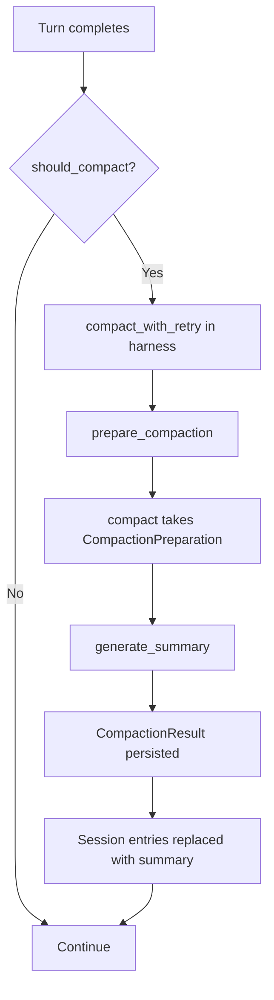

# Compaction

Compaction manages the LLM context window by summarizing older conversation turns when the context approaches the model's token limit. Defined in `crates/elph-agent/src/compaction/`. Compaction runs after each turn in the [Agent Loop](agent-loop.md) when `should_compact()` returns true. It is invoked from the `AgentHarness` (see [Architecture Overview](../architecture/overview.md)) via `compaction_ops.rs` with retry support (commit `4cedf40`).

## Module Structure

```
crates/elph-agent/src/compaction/
├── mod.rs                — re-exports, public API
├── estimation.rs         — token counting, ContextUsageEstimate, find_cut_point, should_compact
├── compact.rs            — compact() — takes CompactionPreparation
├── preparation.rs        — prepare_compaction() — builds CompactionPreparation from session entries
├── summarization.rs      — generate_summary(), generate_turn_prefix_summary() — LLM-based summarization
├── branch_summarization.rs — branch-level summary generation
├── types.rs              — CompactionResult, CompactionDetails
└── utils.rs              — serialize_conversation(), compute_file_lists(), format_file_operations(), create_file_ops()
```

## Compaction Flow



## Key Functions

### `should_compact()` — `estimation.rs`

Simplified signature (commit `6015a35`):

```rust
pub fn should_compact(context_tokens: u64, context_window: u64, settings: CompactionSettings) -> bool {
    if !settings.enabled {
        return false;
    }
    let threshold = match settings.threshold_pct {
        Some(pct) => context_window * (pct as u64) / 100,
        None => context_window.saturating_sub(settings.reserve_tokens),
    };
    context_tokens > threshold
}
```

### `estimate_context_tokens()` — `estimation.rs`

Produces a `ContextUsageEstimate`:

```rust
pub struct ContextUsageEstimate {
    pub tokens: u64,            // total estimated tokens
    pub usage_tokens: u64,      // tokens from provider usage data
    pub trailing_tokens: u64,   // tokens after last usage record
    pub last_usage_index: Option<usize>,  // index of last valid assistant usage
}
```

### `estimate_tokens_with_system_prompt()` — `estimation.rs`

Added to avoid double-counting system prompt tokens when provider usage data is available (commit `eb93ec2`):

```rust
pub fn estimate_tokens_with_system_prompt(estimate: ContextUsageEstimate, system_prompt: Option<&str>) -> u64
```

### `find_cut_point()` — `estimation.rs`

Selects the oldest entries to summarize. Uses `get_last_assistant_usage()` to find the timestamp-gated boundary.

### `compact()` — `compact.rs`

Refactored to take a single `CompactionPreparation` struct (commit `4cedf40`):

```rust
pub async fn compact(
    preparation: CompactionPreparation,
    models: &Models,
    model: &Model,
    custom_instructions: Option<&str>,
    signal: Option<CancellationToken>,
    thinking_level: Option<ThinkingLevel>,
) -> Result<CompactionResult, CompactionError>
```

### `prepare_compaction()` — `preparation.rs`

Builds `CompactionPreparation` from session entries for the harness:

```rust
pub async fn prepare_compaction(...) -> Result<CompactionPreparation, CompactionError>
```

### `generate_summary()` — `summarization.rs`

Uses the LLM to produce a summary via `SUMMARIZATION_SYSTEM_PROMPT` (`crates/elph-agent/src/compaction/mod.rs` re-exports `crate::prompt::builtin::compaction::SUMMARIZATION_SYSTEM_PROMPT`). Produces a `CompactionResult` with:

- `summary` — the LLM-generated summary text
- `metadata` — provenance (tokens, model used, timestamps)
- `file_operations` — aggregated file operations since last compaction

### `generate_turn_prefix_summary()` — `summarization.rs`

Added for split-turn compaction support (commit `4cedf40`).

## CompactionSettings

```rust
pub struct CompactionSettings {
    pub enabled: bool,                   // master switch
    pub reserve_tokens: u64,             // tokens reserved (default 16384)
    pub threshold_pct: Option<u8>,       // percentage of context window — Some(80) = compact at 80%
    pub keep_recent_tokens: u64,         // minimum tokens to keep (default 20000)
}
```

Default: `DEFAULT_COMPACTION_SETTINGS` (from `crates/elph-agent/src/agent/harness/types/options.rs`):

```rust
pub const DEFAULT_COMPACTION_SETTINGS: CompactionSettings = CompactionSettings {
    enabled: true,
    reserve_tokens: 16384,
    threshold_pct: Some(80),
    keep_recent_tokens: 20000,
};
```

### /compact Slash Command Options (commit `e5144fa`)

The TUI `/compact` slash command now accepts optional arguments, parsed by `parse_compact_args()` in `crates/coding-agent/src/agent/slash_commands.rs`:

| Flag              | Type   | Description                                            |
| ----------------- | ------ | ------------------------------------------------------ |
| `--threshold PCT` | `u8`   | Override compaction threshold (1-100, clamped)         |
| `--keep-recent N` | `u64`  | Override tokens to keep after compaction               |
| `--model MODEL`   | String | Override model for summarization (e.g. `openai/gpt-4`) |
| `--memory-flush`  | bool   | Enable memory flush before compaction                  |

Examples:

```
/compact --threshold 85 --keep-recent 15000
/compact --model openai/gpt-4 --memory-flush
/compact --threshold 90
```

`CompactOptions` (from `slash_commands.rs`) is dispatched to `CodingAgentSession::compact_with_options()`. The `model_override` parameter on `run_compact_with_notices()` allows the `/compact --model` value to override the default compaction model.

## Compaction Retry

The harness wraps compaction in `compact_with_retry()` (from `compaction_ops.rs`) with exponential backoff:

- `COMPACTION_MAX_RETRIES: u32 = 3`
- `COMPACTION_RETRY_BASE_DELAY_MS: u64 = 1000`
- Emits `CompactionRetry` lifecycle events for each attempt

## Branch Summarization

`branch_summarization.rs` handles multi-turn session branches:

- `collect_entries_for_branch_summary()` — gathers entries spanning a branch
- `generate_branch_summary()` — produces a summary for a branch
- `BranchPreparation` — intermediate state for branch-level compaction
- `prepare_branch_entries()` — prepares branch entries for summarization

## Source References

- `crates/elph-agent/src/compaction/estimation.rs` — `estimate_context_tokens()`, `find_cut_point()`, `should_compact()`, `estimate_tokens_with_system_prompt()`
- `crates/elph-agent/src/compaction/compact.rs` — `compact()` entry point (takes `CompactionPreparation`)
- `crates/elph-agent/src/compaction/preparation.rs` — `prepare_compaction()`
- `crates/elph-agent/src/compaction/summarization.rs` — `generate_summary()`, `generate_turn_prefix_summary()`
- `crates/elph-agent/src/compaction/branch_summarization.rs` — branch-level compaction
- `crates/elph-agent/src/compaction/types.rs` — `CompactionResult`, `CompactionDetails`
- `crates/elph-agent/src/compaction/utils.rs` — `serialize_conversation()`, `compute_file_lists()`, `create_file_ops()`
- `crates/elph-agent/src/agent/harness/compaction_ops.rs` — `compact_with_retry()`, harness integration
- `crates/elph-agent/src/agent/harness/types/options.rs` — `CompactionSettings`, `DEFAULT_COMPACTION_SETTINGS`
- `crates/coding-agent/src/agent/session/compaction.rs` — `CodingAgentSession::compact()`, `compact_with_options()`, `run_compact_with_notices()` (accepts `model_override`)
- `crates/coding-agent/src/agent/slash_commands.rs` — `CompactOptions`, `parse_compact_args()`, `/compact` slash dispatch
