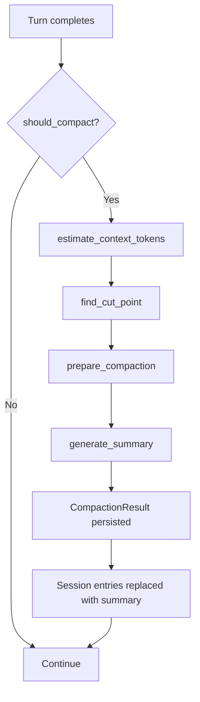

# Compaction

Compaction manages the LLM context window by summarizing older conversation turns when the context approaches the model's token limit. Defined in `crates/elph-agent/src/compaction/`. Compaction runs after each turn in the [Agent Loop](agent-loop.md) when `should_compact()` returns true. It is invoked from the `AgentHarness` (see [Architecture Overview](../architecture/overview.md)) via `compaction_ops.rs`.

## Module Structure

```
crates/elph-agent/src/compaction/
├── mod.rs                — re-exports
├── estimation.rs         — token counting, ContextUsageEstimate, find_cut_point
├── compact.rs            — compact() — the main compaction entry point
├── preparation.rs        — prepare_compaction() — builds CompactionPreparation
├── summarization.rs      — generate_summary() — LLM-based summarization
├── branch_summarization.rs — branch-level summary generation
├── types.rs              — CompactionResult, CompactionDetails
└── utils.rs              — serialize_conversation(), compute_file_lists(), format_file_operations()
```

## Compaction Flow



## Key Functions

### `should_compact()` — `estimation.rs`

Checks whether compaction is needed based on `CompactionSettings`:

```rust
pub fn should_compact(
    entries: &[SessionTreeEntry],
    model_max_tokens: u64,
    settings: &CompactionSettings,
) -> bool {
    // 1. Calculate estimate via estimate_context_tokens()
    // 2. Compare against model_max_tokens * settings.threshold (default 0.75)
    // 3. Return true if exceeded
}
```

### `estimate_context_tokens()` — `estimation.rs`

Produces a `ContextUsageEstimate`:

```rust
pub struct ContextUsageEstimate {
    pub tokens: u64,            // total estimated tokens
    pub usage_tokens: u64,      // tokens from provider usage data
    pub trailing_tokens: u64,   // tokens after last usage record
    pub last_usage_index: Option<usize>,  // index of last valid assistant usage
}
```

### `find_cut_point()` — `estimation.rs`

Selects the oldest entries to summarize. Uses `get_last_assistant_usage()` to find the timestamp-gated boundary (commit `#6464` — timestamp-aware estimate).

### `compact()` — `compact.rs`

The main compaction entry:

```rust
pub async fn compact(
    session: &impl SessionStorage,
    context: &mut AgentContext,
    entries: &[SessionTreeEntry],
    settings: &CompactionSettings,
    model: &Model,
    model_max_tokens: u64,
    file_ops: FileOperations,
    skills: &[SourcedSkill],
    resources: &AgentHarnessResources,
    hook_registry: &HookRegistry,
    state: &mut AgentState,
    signal: Option<CancellationToken>,
) -> Result<CompactResult, CompactionError>
```

### `generate_summary()` — `summarization.rs`

Uses the LLM to produce a summary via `SUMMARIZATION_SYSTEM_PROMPT` (`crates/elph-agent/src/prompt/builtin/compaction.rs`). Produces a `CompactionResult` with:

- `summary` — the LLM-generated summary text
- `metadata` — provenance (tokens, model used, timestamps)
- `file_operations` — aggregated file operations since last compaction

## CompactionSettings

```rust
pub struct CompactionSettings {
    pub threshold: f64,          // default 0.75 — fraction of model_max_tokens
    pub min_tokens: u64,         // minimum tokens to keep (not compacted)
    pub max_tokens: u64,         // maximum tokens for summarization output
    pub enabled: bool,           // master switch
}
```

Default: `DEFAULT_COMPACTION_SETTINGS` (exported from `crates/elph-agent/src/agent/harness/types.rs`).

## Branch Summarization

`branch_summarization.rs` handles multi-turn session branches:

- `collect_entries_for_branch_summary()` — gathers entries spanning a branch
- `generate_branch_summary()` — produces a summary for a branch
- `BranchPreparation` — intermediate state for branch-level compaction

## Source References

- `crates/elph-agent/src/compaction/estimation.rs` — `estimate_context_tokens()`, `find_cut_point()`, `should_compact()`
- `crates/elph-agent/src/compaction/compact.rs` — `compact()` entry point
- `crates/elph-agent/src/compaction/summarization.rs` — `generate_summary()`
- `crates/elph-agent/src/compaction/branch_summarization.rs` — branch-level compaction
- `crates/elph-agent/src/compaction/types.rs` — `CompactionResult`, `CompactionDetails`
- `crates/elph-agent/src/compaction/utils.rs` — `serialize_conversation()`, `compute_file_lists()`
- `crates/elph-agent/src/agent/harness/types.rs` — `CompactionSettings`, `DEFAULT_COMPACTION_SETTINGS`
