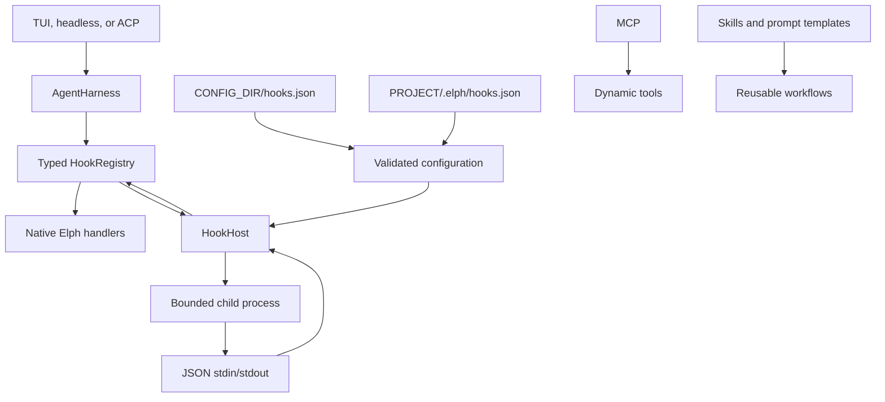

# Lifecycle hooks

Elph lifecycle hooks are native commands configured with JSON. They can observe
or influence agent lifecycle events, but they cannot add tools, providers, UI,
or slash commands.

## Configuration

Elph loads hook definitions from:

1. `CONFIG_DIR/hooks.json`
2. `<project>/.elph/hooks.json`, only after the project passes the trust gate

When `defaultProjectTrust` is `ask`, interactive TUI startup asks whether to
trust an untrusted project before opening the datastore or TUI. Selecting No,
declining the prompt, or starting without a terminal exits without launching
the project. A positive answer records the project in `CONFIG_DIR/trust.json`.

The home file is loaded first and the project file is appended. Hook IDs must
be unique across both files. A malformed file is ignored as a unit.

## Trust controls

Use `/trust` to mark the current project trusted. Use `/untrust` to write an
explicit `false` decision, but only when the project is currently trusted.
An explicit project decision overrides inherited trust from a parent directory.
The command palette shows exactly one of these commands based on the current
trust state and refreshes after either command succeeds.

The canonical schema is
[`schemas/hooks-schema.json`](https://github.com/riipandi/elph/blob/main/schemas/hooks-schema.json).
A minimal project example is available at
[`.elph/hooks.json`](https://github.com/riipandi/elph/blob/main/.elph/hooks.json).

```json
{
  "$schema": "https://elph.space/hooks-schema.json",
  "hooks": [
    {
      "id": "audit-tool-calls",
      "event": "sessionStart",
      "command": "hooks/audit-tool-calls.sh",
      "timeoutMs": 5000,
      "enabled": true
    }
  ]
}
```

`command` is executed directly; Elph does not invoke a shell implicitly.
Relative executable paths resolve against the directory containing the
defining `hooks.json`. The child process working directory is the active
project directory. Use an explicit shell executable and literal `args` when
shell syntax is required.

The project configuration can reference an executable in
`PROJECT_DIR/.elph/hooks/`, as shown in the sample. Elph does not automatically
discover or load every file under that directory; each hook must be declared in
`hooks.json`. The sample script appends the received `sessionStart` JSON payload
to `.elph/hook-audit.log` and keeps stdout empty.

## Architecture



`elph-agent` owns typed lifecycle contracts and validation. `coding-agent`
owns JSON discovery, project trust, process execution, timeouts, output bounds,
and diagnostics. Hooks do not load WASM or Pi extensions.

### Hook fields

| Field | Required | Description |
| --- | --- | --- |
| `id` | Yes | Unique identifier across global and project hooks |
| `event` | Yes | Lifecycle event to receive |
| `matcher` | No | Tool-name filter for tool events |
| `command` | Yes | Executable path or program available on `PATH` |
| `args` | No | Literal command arguments |
| `timeoutMs` | No | Timeout from 1 to 60,000 ms; default 10,000 |
| `enabled` | No | Whether to register the hook; default `true` |

The JSON Schema rejects unknown fields, invalid event names, empty IDs and
commands, invalid timeout values, and matchers on non-tool events. Duplicate
IDs across the merged global/project configuration are reported as
diagnostics.

### Tool names for matchers

Matchers use the names registered in Elph's tool catalog, not editor or agent
file-editing commands. Availability depends on compiled features, agent mode,
and MCP activation.

| Tool group | Current tool names |
| --- | --- |
| Read and search | `read_file`, `grep`, `find_path`, `list_dir` |
| File mutations | `edit_file`, `write_file`, `create_dir`, `copy_path`, `delete_path`, `move_path` |
| Shell | `shell_exec`, `shell_use` |
| Web | `web_search`, `web_fetch`, `web_extract` |
| Discovery | `list_available_tools`, `list_skills` |
| Interactive agent | `ask_user_question`, `request_mode_change` |
| Goals | `create_goal`, `get_goal`, `update_goal`, `set_goal_budget` |
| Todos | `todo_write`, `todo_read` |
| Memory | `memory_start_task`, `memory_end_task`, `memory_report`, `memory_contradict`, `memory_status`, `memory_search`, `memory_recent` |
| Session | `get_session_summary` |
| Collaboration | `spawn_agent`, `send_message`, `followup_task`, `wait_agent`, `list_agents` |
| MCP | `mcp_{server}__{tool}` when registered and activated |

For example, use `edit_file` rather than `apply_patch` in a matcher.
`apply_patch` is an editing operation provided by the development environment,
not an Elph model tool.

## Events

Supported events are:

- `sessionStart` — once when a session is initialized.
- `userPromptSubmit` — before an agent turn; observation-only.
- `beforeAgent` — before a provider request; may append `systemPrompt` or
  `additionalContext`, and may append temporary `messages` to the turn.
- `context` — after the turn context is assembled and before it is sent to the
  provider; may replace the complete `messages` array for that request.
- `preToolUse` — before native approval and execution; may block a tool call or
  replace `toolInput`.
- `postToolUse` — after a successful tool call; may replace `content`,
  `details`, or `isError`, and may request `terminate`.
- `postToolUseFailure` — after a failed tool call; supports the same result
  patch fields as `postToolUse`.
- `preCompact` — before compaction; may cancel or provide instructions.
- `postCompact` — after compaction; observation-only.
- `stop` — when a turn settles; observation-only.

`sessionEnd` is reserved in the schema but is not emitted by the current ACP
session owner.

Tool events may use `matcher.toolNames` with exact, `prefix*`, or `*suffix`
patterns. Handlers run serially in configuration order. Transformations are
passed to the next matching handler for tool events, and native tool-call
decisions are merged.

### Outcomes

An outcome is optional. Empty stdout means that the hook made no change.

Block a tool in `preToolUse`:

```json
{
  "block": true,
  "reason": "Writing .env is not allowed"
}
```

Add instructions before a provider request:

```json
{
  "systemPrompt": "Remember the repository deployment policy."
}
```

Replace the provider-bound context for one request:

```json
{
  "messages": [
    {
      "role": "user",
      "content": "Redacted context"
    }
  ]
}
```

Rewrite validated tool arguments:

```json
{
  "toolInput": {
    "path": "safe/path.txt"
  }
}
```

Replace a tool result:

```json
{
  "content": [
    {
      "type": "text",
      "text": "Sanitized result"
    }
  ],
  "details": {
    "source": "policy-filter"
  },
  "isError": false,
  "terminate": false
}
```

Cancel compaction or add compaction instructions:

```json
{
  "cancel": false,
  "customInstructions": "Preserve the deployment checklist."
}
```

`beforeAgent.systemPrompt` and `beforeAgent.additionalContext` are appended to
the compiled system prompt with a blank-line separator. `beforeAgent.messages`
are appended to the current turn only and are not persisted as session entries.
`context.messages` replaces the full provider-bound message array without
changing the durable transcript.

`preToolUse.toolInput` is passed through the remaining hook chain and validated
against the tool schema again before native approval and execution. `allow` and
`ask` do not loosen native approval decisions.

Post-tool `content` must contain text blocks
`{ "type": "text", "text": "..." }` or image blocks
`{ "type": "image", "data": "...", "mime_type": "..." }`. These fields are
validated before the replacement reaches the model context.

## Feature matrix

| Feature | Status | Notes |
| --- | --- | --- |
| Observe session and turn lifecycle | Supported | `sessionStart`, `userPromptSubmit`, and `stop` |
| Add a system prompt/context | Supported | `beforeAgent.systemPrompt` and `additionalContext` |
| Inject temporary messages | Supported | `beforeAgent.messages` |
| Transform provider context | Supported | `context.messages` replacement |
| Block a tool call | Supported | `preToolUse` with `block: true` or `decision: "deny"` |
| Filter tool events | Supported | Exact, `prefix*`, and `*suffix` patterns |
| Modify tool input | Supported | `preToolUse.toolInput`, schema-validated again |
| Modify tool results | Supported | Content, details, error state, and termination |
| Control compaction | Supported | `preCompact.cancel` and `customInstructions` |
| Audit compaction | Supported | `postCompact` is observation-only |
| Reload configuration | Supported | `/reload` replaces active command handlers |
| Project-local hooks | Supported with trust | Requires the project executable-resource trust gate |
| Add tools or tool servers | Not supported by hooks | Use MCP |
| Add providers or model catalogs | Not supported by hooks | Use provider JSON with an existing adapter |
| Add slash commands or prompt workflows | Not supported by hooks | Use prompt templates and skills |
| Add TUI components | Not supported | UI remains native Elph code |
| Load WASM or Pi extensions | Not supported | The former extension runtime was removed |

## Limitations

- Hook commands run serially in configuration order and are awaited by the
  lifecycle operation.
- `userPromptSubmit`, `sessionStart`, `postCompact`, and `stop` are
  observation-only in the current implementation.
- `beforeAgent` cannot remove or replace the compiled system prompt. `context`
  can replace provider-bound messages, but cannot rewrite the durable transcript.
- Hooks cannot add tools through `postToolUse.addedToolNames`; dynamic tool
  registration remains an MCP responsibility.
- A hook cannot loosen native approval, sandbox, authentication, MCP policy, or
  tool-schema decisions.
- `sessionEnd` is reserved in the schema but is not emitted by the current ACP
  session owner.
- Hook failures fail open: spawn errors, non-zero exits, timeouts, malformed
  JSON, and oversized output do not abort the surrounding agent operation.
- Hooks run with the user's operating-system permissions and are not a
  security boundary.
- Hooks do not run in the background and do not expose streaming token events.

## Command protocol and safety

- JSON is sent on stdin; an optional JSON outcome is read from stdout.
- Empty stdout means no change. Stderr is diagnostic text and is not parsed.
- Spawn errors, non-zero exits, timeouts, invalid JSON, and oversized output
  fail open for the current operation.
- Input is limited to 128 KiB; stdout and stderr are limited to 64 KiB.
- The default timeout is 10 seconds and the maximum is 60 seconds.
- Returned context is limited to 32 KiB.
- Commands run with the user's operating-system permissions and are not a
  security boundary.

Use native approval, sandbox, agent mode, MCP policy, and tool-schema
validation for security enforcement.

The child process receives a small environment allowlist plus `ELPH_HOOK_ID`.
Credentials, provider headers, auth-store values, and arbitrary environment
variables are not passed to hooks. The `context` event intentionally receives
the current provider-bound message array, but changes to it are not persisted
to the session transcript.

## Reload and integration boundaries

Use `/reload` after editing either hook file. The command reloads hooks and
other workspace resources without restarting the TUI. `elph doctor` reports
hook configuration diagnostics and the project trust state.

Use MCP for dynamic tools, skills and prompt templates for reusable workflows,
and `CONFIG_DIR/providers/*.json` for custom provider catalogs supported by an
existing Elph adapter.
